# AIDRA — Database Design (Step 2)

**Product:** AIDRA — AI-Powered Disaster Response Platform
**Document:** Production-grade PostgreSQL schema · **Version:** 1.0 · **Date:** September 25, 2026
**Target:** PostgreSQL 16+ with PostGIS 3.4+, `pgcrypto`, `citext`, `pg_trgm`, `pg_partman` (or `pg_cron`)
**Companion docs:** [PRD.md](./PRD.md) · [PRD-VOLUME-II.md](./PRD-VOLUME-II.md) · [DESIGN-SYSTEM.md](./DESIGN-SYSTEM.md)

**Contents:** [0 Design Principles](#0-design-principles) · [1 Conventions](#1-conventions) · [2 ER Diagram](#2-er-diagram) · [3 Enum Types](#3-enum-types) · [4 Identity/Orgs/Profiles](#4-identity-organizations--profiles) · [5 Reports/Incidents/Events](#5-reports-incidents--events) · [6 Assignments/Routes/Roads](#6-assignments-routes--road-status) · [7 Resources/Requests/Shelters/Hospitals](#7-resources-requests-shelters--hospital-operations) · [8 Notifications/Broadcasts/Chats](#8-notifications-broadcasts--chats) · [9 Platform Tables](#9-cross-cutting-platform-tables) · [10 Relationships](#10-relationships-summary) · [11 Indexes](#11-index-catalog-what-each-index-is-for) · [12 Partitioning & Retention](#12-partitioning-performance--retention) · [13 Security Rules](#13-security-rules) · [14 Triggers & Automation](#14-data-integrity-triggers--automation) · [15 Sizing & Ops](#15-capacity-sizing--operations) · [16 Traceability](#16-requirement-traceability)

---

## 0. Design Principles

1. **Offline-first, sync-safe** — every mutating client call carries an `idempotency_key` / `client_mutation_id`; replay never duplicates data.
2. **Geo-native** — PostGIS `geography(Point,4326)` for every location; GIST indexes; radius queries must stay < 100 ms at city scale.
3. **Time-partitioned hot tables** — reports, notifications, messages, incident updates, resource transactions grow fastest; RANGE partition by month.
4. **Auditable by construction** — hash-chained `audit_logs`, AI decision log, append-only grants.
5. **Privacy by default** — raw PII encrypted, precise location blurred to ±500 m for non-assigned roles (PRD §9.4), retention enforced by partition drops.
6. **Integrity in the database** — CHECK constraints, enum types, exclusion constraints, and triggers enforce rules the API must not be trusted to enforce alone.
7. **Tenant-aware** — `organization_id` flows through every operational table so NGOs/hospitals/authorities can be isolated and federated later (Volume II §12 Phase 5).

### Entity Map (PRD entity → schema objects)

| PRD entity | Tables |
|---|---|
| Users | `users`, `user_roles`, `auth_identities`, `sessions`, `otp_codes`, `device_tokens`, `notification_preferences` |
| Victims | `victim_profiles` |
| Volunteers | `volunteer_profiles`, `volunteer_skills`, `skills`, `volunteer_availability_log` |
| Authorities | `organizations` (type=`authority`), `authority_profiles`, `broadcasts` |
| NGOs | `organizations` (type=`ngo`), `ngo_profiles`, `org_units`, `resource_requests` |
| Hospitals | `hospitals`, `hospital_capacity_snapshots`, `casualty_prealerts` |
| Resources | `resources`, `resource_transactions`, `resource_requests`, `shelters` |
| Emergency Reports | `emergency_reports`, `report_media`, `incident_reports` |
| Incidents | `incidents`, `events`, `incident_updates`, `assignments` |
| Routes | `routes`, `road_segments` |
| Notifications | `notifications`, `notification_preferences`, `broadcasts`, `broadcast_recipients` |
| Chats | `conversations`, `conversation_participants`, `messages` |
| Platform/cross-cutting | `ai_decisions`, `audit_logs`, `sync_outbox`, `app_config` |

---

## 1. Conventions

| Rule | Convention |
|---|---|
| Keys | `uuid` v7 (time-ordered) for entities; `bigint GENERATED ALWAYS AS IDENTITY` for high-volume append-only tables |
| Naming | plural snake_case tables, singular columns, `*_id` FKs, `is_*` booleans, `*_at` timestamptz |
| Timestamps | `created_at timestamptz NOT NULL DEFAULT now()`, `updated_at` maintained by trigger; all UTC |
| Soft delete | `deleted_at timestamptz NULL` on user-facing entities; hard delete only via retention job |
| Geo | `latitude/longitude numeric(9,6)` **plus** generated `location geography(Point,4326)` (`ST_MakePoint` → `ST_SetSRID` → `::geography` are all IMMUTABLE, so the column is `GENERATED ALWAYS AS … STORED`) — keeps coordinates printable, app-friendly, and GIST-indexable. *Fallback:* if your PostGIS build rejects the cast in a generated column, keep `location` as a plain column maintained by a `BEFORE INSERT/UPDATE` trigger instead — every query and index in this doc stays identical. |
| Enums | native `CREATE TYPE ... AS ENUM` (stable, compact); reference data (skills, hazard types) in real tables |
| Money-free | no currency in v1 (out of scope) |
| Idempotency | unique `idempotency_key uuid` on all client-created rows |

---

## 2. ER Diagram

```mermaid
erDiagram
    ORGANIZATIONS ||--o{ ORG_UNITS : has
    ORGANIZATIONS ||--o{ USERS : employs
    ORGANIZATIONS ||--o| NGO_PROFILES : "ngo extension"
    ORGANIZATIONS ||--o| HOSPITALS : "hospital extension"
    ORGANIZATIONS ||--o{ RESOURCES : owns
    USERS ||--o{ USER_ROLES : holds
    USERS ||--o| VICTIM_PROFILES : "victim extension"
    USERS ||--o| VOLUNTEER_PROFILES : "volunteer extension"
    USERS ||--o| AUTHORITY_PROFILES : "authority extension"
    USERS ||--o{ DEVICE_TOKENS : registers
    USERS ||--o| NOTIFICATION_PREFERENCES : configures
    VOLUNTEER_PROFILES ||--o{ VOLUNTEER_SKILLS : has
    SKILLS ||--o{ VOLUNTEER_SKILLS : classified_by
    USERS ||--o{ EMERGENCY_REPORTS : files
    EMERGENCY_REPORTS ||--o{ REPORT_MEDIA : contains
    EMERGENCY_REPORTS ||--o{ INCIDENT_REPORTS : linked_by
    INCIDENTS ||--o{ INCIDENT_REPORTS : groups
    INCIDENTS ||--o{ INCIDENT_UPDATES : logs
    EVENTS ||--o{ INCIDENTS : clusters
    INCIDENTS ||--o{ ASSIGNMENTS : dispatched_to
    USERS ||--o{ ASSIGNMENTS : accepts
    ORGANIZATIONS ||--o{ ASSIGNMENTS : assigned_org
    ASSIGNMENTS ||--o| ROUTES : navigates
    INCIDENTS ||--o{ ROUTES : targets
    ROAD_SEGMENTS ||--o{ ROUTES : avoided_by
    EMERGENCY_REPORTS ||--o{ ROAD_SEGMENTS : reports_status
    HOSPITALS ||--o{ HOSPITAL_CAPACITY_SNAPSHOTS : records
    HOSPITALS ||--o{ CASUALTY_PREALERTS : receives
    INCIDENTS ||--o{ CASUALTY_PREALERTS : triggers
    INCIDENTS ||--o{ RESOURCE_REQUESTS : needs
    ORGANIZATIONS ||--o{ RESOURCE_REQUESTS : requests
    RESOURCES ||--o{ RESOURCE_TRANSACTIONS : moves
    USERS ||--o{ NOTIFICATIONS : receives
    INCIDENTS ||--o{ NOTIFICATIONS : about
    BROADCASTS ||--o{ BROADCAST_RECIPIENTS : delivered_to
    CONVERSATIONS ||--o{ CONVERSATION_PARTICIPANTS : includes
    USERS ||--o{ CONVERSATION_PARTICIPANTS : joins
    CONVERSATIONS ||--o{ MESSAGES : contains
    INCIDENTS ||--o{ CONVERSATIONS : "incident thread"
    USERS ||--o{ AUDIT_LOGS : performs
    USERS ||--o{ AI_DECISIONS : "overridden_by"
    USERS ||--o{ SYNC_OUTBOX : syncs
```



---

## 3. Enum Types

```sql
CREATE EXTENSION IF NOT EXISTS postgis;
CREATE EXTENSION IF NOT EXISTS pgcrypto;
CREATE EXTENSION IF NOT EXISTS citext;
CREATE EXTENSION IF NOT EXISTS pg_trgm;

CREATE TYPE user_role          AS ENUM ('victim','volunteer','ngo_coordinator','hospital_coordinator','authority','super_admin');
CREATE TYPE org_type           AS ENUM ('ngo','hospital','authority','partner');
CREATE TYPE verification_state AS ENUM ('unverified','pending','verified','rejected','suspended');
CREATE TYPE report_input_type  AS ENUM ('text','voice','image','video');
CREATE TYPE media_kind         AS ENUM ('image','audio','video','document');
CREATE TYPE urgency_level      AS ENUM ('low','medium','high','critical');          -- PRD Vol II §4 L1–L4
CREATE TYPE report_status      AS ENUM ('new','triaged','awaiting_verification','verified','assigned','in_progress','resolved','false_alarm','duplicate','closed');
CREATE TYPE incident_status    AS ENUM ('open','assigned','in_progress','contained','resolved','false_alarm','duplicate','closed');
CREATE TYPE incident_source    AS ENUM ('report','authority','partner_api','ai_cluster','sensor');
CREATE TYPE event_class        AS ENUM ('watch','amber','red');
CREATE TYPE link_type          AS ENUM ('primary','duplicate','supporting');
CREATE TYPE assignment_role    AS ENUM ('primary','supporting','standby');
CREATE TYPE assignment_status  AS ENUM ('offered','accepted','declined','en_route','on_scene','resolved','cancelled','expired');
CREATE TYPE road_status        AS ENUM ('open','restricted','blocked','flooded','damaged','unknown');
CREATE TYPE resource_category  AS ENUM ('food','water','medicine','shelter','equipment','fuel','hygiene','other');
CREATE TYPE resource_txn_type  AS ENUM ('receipt','dispatch','consume','transfer_out','transfer_in','adjustment','expiry','return');
CREATE TYPE visibility_scope   AS ENUM ('org','shared','public');
CREATE TYPE request_status     AS ENUM ('open','approved','dispatched','fulfilled','declined','cancelled','expired');
CREATE TYPE shelter_status     AS ENUM ('open','full','closed','standby');
CREATE TYPE notification_channel  AS ENUM ('push','sms','email','in_app','voice_call');
CREATE TYPE notification_priority AS ENUM ('p0','p1','p2','p3');                    -- PRD Vol II §7.1
CREATE TYPE notification_status   AS ENUM ('queued','sent','delivered','failed','read','suppressed');
CREATE TYPE device_platform    AS ENUM ('ios','android','web');
CREATE TYPE conversation_type  AS ENUM ('direct','incident_thread','org_channel','ai_support');
CREATE TYPE participant_role   AS ENUM ('member','admin','observer','ai');
CREATE TYPE message_type       AS ENUM ('text','image','file','voice','location','system','alert');
CREATE TYPE ai_subject_type    AS ENUM ('report','incident','assignment','route','forecast');
CREATE TYPE ai_outcome         AS ENUM ('pending','accepted','overridden','expired');
CREATE TYPE sync_status        AS ENUM ('received','applied','conflict','rejected');
```

---

## 4. Identity, Organizations & Profiles

### 4.1 Organizations

```sql
CREATE TABLE organizations (
  id                  uuid PRIMARY KEY DEFAULT gen_random_uuid(),
  type                org_type NOT NULL,
  name                text NOT NULL,
  legal_name          text,
  registration_no     text,
  contact_person      text,
  contact_email       citext,
  contact_phone       text,
  address             jsonb,                          -- {line1, city, state, country, pincode}
  headquarters        geography(Point,4326),
  coverage_area       geography(MultiPolygon,4326),   -- NGO/authority operational footprint
  verification_state  verification_state NOT NULL DEFAULT 'pending',
  verified_by         uuid,
  verified_at         timestamptz,
  parent_org_id       uuid REFERENCES organizations(id),
  settings            jsonb NOT NULL DEFAULT '{}'::jsonb,
  is_active           boolean NOT NULL DEFAULT true,
  created_at          timestamptz NOT NULL DEFAULT now(),
  updated_at          timestamptz NOT NULL DEFAULT now(),
  deleted_at          timestamptz,
  CONSTRAINT org_registration_unique UNIQUE (type, registration_no)
);
CREATE INDEX idx_orgs_type_active   ON organizations (type) WHERE deleted_at IS NULL AND is_active;
CREATE INDEX idx_orgs_hq_gist       ON organizations USING GIST (headquarters);
CREATE INDEX idx_orgs_coverage_gist ON organizations USING GIST (coverage_area);
CREATE INDEX idx_orgs_name_trgm     ON organizations USING GIN (name gin_trgm_ops);
```

### 4.2 Organization units (distribution points, wards, shelters, staging areas)

```sql
CREATE TABLE org_units (
  id             uuid PRIMARY KEY DEFAULT gen_random_uuid(),
  org_id         uuid NOT NULL REFERENCES organizations(id) ON DELETE CASCADE,
  name           text NOT NULL,
  unit_type      text NOT NULL,                       -- distribution_center | ward | staging_area | command_post
  location       geography(Point,4326),
  address        jsonb,
  capacity       integer,
  is_active      boolean NOT NULL DEFAULT true,
  metadata       jsonb NOT NULL DEFAULT '{}'::jsonb,
  created_at     timestamptz NOT NULL DEFAULT now(),
  updated_at     timestamptz NOT NULL DEFAULT now(),
  UNIQUE (org_id, name)
);
CREATE INDEX idx_org_units_org   ON org_units (org_id);
CREATE INDEX idx_org_units_geo   ON org_units USING GIST (location);
```

### 4.3 NGO extension

```sql
CREATE TABLE ngo_profiles (
  org_id            uuid PRIMARY KEY REFERENCES organizations(id) ON DELETE CASCADE,
  focus_areas       text[] NOT NULL DEFAULT '{}',     -- flood_relief, medical, search_rescue, shelter...
  operating_regions text[] NOT NULL DEFAULT '{}',
  volunteer_count   integer NOT NULL DEFAULT 0,
  fleet             jsonb NOT NULL DEFAULT '{}'::jsonb,   -- {boats: 4, ambulances: 2, trucks: 3}
  accreditation     jsonb NOT NULL DEFAULT '{}'::jsonb,
  updated_at        timestamptz NOT NULL DEFAULT now()
);
```

### 4.4 Hospitals (org extension + live capacity)

```sql
CREATE TABLE hospitals (
  id                   uuid PRIMARY KEY DEFAULT gen_random_uuid(),
  org_id               uuid NOT NULL REFERENCES organizations(id) ON DELETE CASCADE,
  name                 text NOT NULL,
  facility_code        text UNIQUE,
  location             geography(Point,4326) NOT NULL,
  address              jsonb,
  contact_phone        text,
  trauma_level         smallint CHECK (trauma_level BETWEEN 1 AND 5),
  beds_total           integer NOT NULL DEFAULT 0 CHECK (beds_total >= 0),
  beds_available       integer NOT NULL DEFAULT 0 CHECK (beds_available >= 0),
  icu_total            integer NOT NULL DEFAULT 0 CHECK (icu_total >= 0),
  icu_available        integer NOT NULL DEFAULT 0 CHECK (icu_available >= 0),
  ventilators_total    integer NOT NULL DEFAULT 0,
  ventilators_available integer NOT NULL DEFAULT 0,
  oxygen_units         integer NOT NULL DEFAULT 0,
  blood_inventory      jsonb NOT NULL DEFAULT '{}'::jsonb,  -- {"A+": 12, "O-": 3, ...}
  specialties          text[] NOT NULL DEFAULT '{}',
  status               text NOT NULL DEFAULT 'operational'
                       CHECK (status IN ('operational','diversion','full','closed')),
  is_accepting         boolean NOT NULL DEFAULT true,
  capacity_updated_at  timestamptz,
  capacity_updated_by  uuid,
  created_at           timestamptz NOT NULL DEFAULT now(),
  updated_at           timestamptz NOT NULL DEFAULT now(),
  CONSTRAINT hospital_capacity_sane CHECK (beds_available <= beds_total AND icu_available <= icu_total)
);
CREATE INDEX idx_hospitals_geo        ON hospitals USING GIST (location);
CREATE INDEX idx_hospitals_accepting  ON hospitals (status) WHERE is_accepting;
CREATE INDEX idx_hospitals_org        ON hospitals (org_id);
```

### 4.5 Users, roles, auth

```sql
CREATE TABLE users (
  id                  uuid PRIMARY KEY DEFAULT gen_random_uuid(),
  primary_role        user_role NOT NULL DEFAULT 'victim',
  full_name           text NOT NULL,
  display_name        text,
  email               citext,
  phone               text,
  password_hash       text,                            -- argon2id; NULL for OTP/social-only accounts
  avatar_url          text,
  language            varchar(8) NOT NULL DEFAULT 'en',
  timezone            text NOT NULL DEFAULT 'UTC',
  org_id              uuid REFERENCES organizations(id),
  org_unit_id         uuid REFERENCES org_units(id),
  verification_state  verification_state NOT NULL DEFAULT 'unverified',
  verified_by         uuid REFERENCES users(id),
  verified_at         timestamptz,
  mfa_enabled         boolean NOT NULL DEFAULT false,
  is_active           boolean NOT NULL DEFAULT true,
  last_location       geography(Point,4326),
  location_updated_at timestamptz,
  last_login_at       timestamptz,
  failed_login_count  smallint NOT NULL DEFAULT 0,
  locked_until        timestamptz,
  created_at          timestamptz NOT NULL DEFAULT now(),
  updated_at          timestamptz NOT NULL DEFAULT now(),
  deleted_at          timestamptz,
  CONSTRAINT users_contact_required CHECK (email IS NOT NULL OR phone IS NOT NULL),
  CONSTRAINT users_org_role_consistency CHECK (
    (primary_role IN ('ngo_coordinator','hospital_coordinator','authority') AND org_id IS NOT NULL)
    OR primary_role IN ('victim','volunteer','super_admin')
  ),
  CONSTRAINT users_phone_e164 CHECK (phone IS NULL OR phone ~ '^\+[1-9][0-9]{6,14}$')
);
CREATE UNIQUE INDEX users_email_unique ON users (lower(email)) WHERE email IS NOT NULL AND deleted_at IS NULL;
CREATE UNIQUE INDEX users_phone_unique ON users (phone)        WHERE phone IS NOT NULL AND deleted_at IS NULL;
CREATE INDEX idx_users_role        ON users (primary_role) WHERE is_active AND deleted_at IS NULL;
CREATE INDEX idx_users_org         ON users (org_id)       WHERE deleted_at IS NULL;
CREATE INDEX idx_users_location    ON users USING GIST (last_location);
CREATE INDEX idx_users_name_trgm   ON users USING GIN (full_name gin_trgm_ops);
```

```sql
-- Multi-role support: one person can be volunteer AND victim (PRD §3)
CREATE TABLE user_roles (
  id          uuid PRIMARY KEY DEFAULT gen_random_uuid(),
  user_id     uuid NOT NULL REFERENCES users(id) ON DELETE CASCADE,
  role        user_role NOT NULL,
  org_id      uuid REFERENCES organizations(id),
  granted_by  uuid REFERENCES users(id),
  granted_at  timestamptz NOT NULL DEFAULT now(),
  revoked_at  timestamptz,
  UNIQUE (user_id, role, org_id)
);
CREATE INDEX idx_user_roles_user ON user_roles (user_id) WHERE revoked_at IS NULL;

CREATE TABLE auth_identities (
  id             uuid PRIMARY KEY DEFAULT gen_random_uuid(),
  user_id        uuid NOT NULL REFERENCES users(id) ON DELETE CASCADE,
  provider       text NOT NULL CHECK (provider IN ('password','google','apple','phone_otp','govt_sso')),
  provider_uid   text NOT NULL,
  provider_data  jsonb NOT NULL DEFAULT '{}'::jsonb,
  created_at     timestamptz NOT NULL DEFAULT now(),
  UNIQUE (provider, provider_uid)
);

CREATE TABLE sessions (
  id                 uuid PRIMARY KEY DEFAULT gen_random_uuid(),
  user_id            uuid NOT NULL REFERENCES users(id) ON DELETE CASCADE,
  refresh_token_hash text NOT NULL,
  device_id          text,
  ip_address         inet,
  user_agent         text,
  expires_at         timestamptz NOT NULL,
  revoked_at         timestamptz,
  created_at         timestamptz NOT NULL DEFAULT now()
);
CREATE INDEX idx_sessions_user_active ON sessions (user_id, expires_at DESC) WHERE revoked_at IS NULL;

CREATE TABLE otp_codes (
  id           uuid PRIMARY KEY DEFAULT gen_random_uuid(),
  destination  text NOT NULL,                          -- phone or email
  purpose      text NOT NULL DEFAULT 'login' CHECK (purpose IN ('login','verify_phone','verify_email','reset_password')),
  code_hash    text NOT NULL,
  attempts     smallint NOT NULL DEFAULT 0,
  max_attempts smallint NOT NULL DEFAULT 5,
  expires_at   timestamptz NOT NULL,
  consumed_at  timestamptz,
  ip_address   inet,
  created_at   timestamptz NOT NULL DEFAULT now()
);
CREATE INDEX idx_otp_destination ON otp_codes (destination, purpose, expires_at DESC);

CREATE TABLE device_tokens (
  id           uuid PRIMARY KEY DEFAULT gen_random_uuid(),
  user_id      uuid NOT NULL REFERENCES users(id) ON DELETE CASCADE,
  platform     device_platform NOT NULL,
  token        text NOT NULL UNIQUE,
  app_version  text,
  is_active    boolean NOT NULL DEFAULT true,
  last_seen_at timestamptz NOT NULL DEFAULT now(),
  created_at   timestamptz NOT NULL DEFAULT now()
);
CREATE INDEX idx_device_tokens_user ON device_tokens (user_id) WHERE is_active;
```

### 4.6 Role profiles

```sql
CREATE TABLE victim_profiles (
  user_id             uuid PRIMARY KEY REFERENCES users(id) ON DELETE CASCADE,
  vulnerability_flags text[] NOT NULL DEFAULT '{}',    -- elderly, disabled, pregnant, child, chronic_illness
  household_size      smallint CHECK (household_size BETWEEN 1 AND 100),
  blood_group         text CHECK (blood_group IN ('A+','A-','B+','B-','AB+','AB-','O+','O-','unknown')),
  medical_notes_enc   bytea,                           -- pgp_sym_encrypt(AppKey, medical_notes)
  shelter_needed      boolean NOT NULL DEFAULT false,
  emergency_contacts  jsonb NOT NULL DEFAULT '[]'::jsonb,
  consent_flags       jsonb NOT NULL DEFAULT '{"location":true,"notifications":true,"analytics":true,"research":false}'::jsonb,
  created_at          timestamptz NOT NULL DEFAULT now(),
  updated_at          timestamptz NOT NULL DEFAULT now()
);

CREATE TABLE skills (
  id         uuid PRIMARY KEY DEFAULT gen_random_uuid(),
  code       text NOT NULL UNIQUE,                     -- medical, search_rescue, boat_operator, driver, logistics...
  label      text NOT NULL,
  category   text NOT NULL,
  is_active  boolean NOT NULL DEFAULT true
);

CREATE TABLE volunteer_profiles (
  user_id              uuid PRIMARY KEY REFERENCES users(id) ON DELETE CASCADE,
  org_id               uuid REFERENCES organizations(id),   -- if affiliated (NGO/NDRF-style)
  availability         text NOT NULL DEFAULT 'unavailable'
                       CHECK (availability IN ('available','assigned','en_route','on_scene','offline','unavailable')),
  max_travel_km        numeric(6,2) NOT NULL DEFAULT 20 CHECK (max_travel_km > 0),
  has_vehicle          boolean NOT NULL DEFAULT false,
  blood_group          text,
  languages            text[] NOT NULL DEFAULT '{en}',
  rating               numeric(3,2) NOT NULL DEFAULT 0 CHECK (rating BETWEEN 0 AND 5),
  total_assignments    integer NOT NULL DEFAULT 0,
  accepted_assignments integer NOT NULL DEFAULT 0,
  completed_assignments integer NOT NULL DEFAULT 0,
  current_load         smallint NOT NULL DEFAULT 0 CHECK (current_load BETWEEN 0 AND 10),
  certifications       jsonb NOT NULL DEFAULT '[]'::jsonb,
  verification_docs    jsonb NOT NULL DEFAULT '[]'::jsonb,
  verified_at          timestamptz,
  last_heartbeat_at    timestamptz,
  created_at           timestamptz NOT NULL DEFAULT now(),
  updated_at           timestamptz NOT NULL DEFAULT now()
);
CREATE INDEX idx_volunteers_available ON volunteer_profiles (availability, current_load)
  WHERE availability IN ('available','assigned');
CREATE INDEX idx_volunteers_org ON volunteer_profiles (org_id);

CREATE TABLE volunteer_skills (
  volunteer_id uuid NOT NULL REFERENCES volunteer_profiles(user_id) ON DELETE CASCADE,
  skill_id     uuid NOT NULL REFERENCES skills(id) ON DELETE CASCADE,
  proficiency  smallint NOT NULL DEFAULT 1 CHECK (proficiency BETWEEN 1 AND 5),
  is_verified  boolean NOT NULL DEFAULT false,
  verified_by  uuid REFERENCES users(id),
  PRIMARY KEY (volunteer_id, skill_id)
);
CREATE INDEX idx_volunteer_skills_skill ON volunteer_skills (skill_id);

CREATE TABLE volunteer_availability_log (         -- feeds reliability KPI (Vol II §3.2)
  id           bigint GENERATED ALWAYS AS IDENTITY,
  volunteer_id uuid NOT NULL REFERENCES volunteer_profiles(user_id) ON DELETE CASCADE,
  status       text NOT NULL,
  latitude     numeric(9,6),
  longitude    numeric(9,6),
  recorded_at  timestamptz NOT NULL DEFAULT now(),
  PRIMARY KEY (id, recorded_at)
) PARTITION BY RANGE (recorded_at);
CREATE TABLE volunteer_availability_log_2026_09 PARTITION OF volunteer_availability_log
  FOR VALUES FROM ('2026-09-01') TO ('2026-10-01');
CREATE INDEX idx_vol_avail_vol_time ON volunteer_availability_log (volunteer_id, recorded_at DESC);

CREATE TABLE authority_profiles (
  user_id          uuid PRIMARY KEY REFERENCES users(id) ON DELETE CASCADE,
  authority_level  text NOT NULL CHECK (authority_level IN ('local','district','state','national')),
  department       text,
  jurisdiction     geography(MultiPolygon,4326),
  badge_no         text,
  can_broadcast    boolean NOT NULL DEFAULT false,
  can_verify       boolean NOT NULL DEFAULT true,
  can_assign       boolean NOT NULL DEFAULT true,
  can_manage_orgs  boolean NOT NULL DEFAULT false,
  created_at       timestamptz NOT NULL DEFAULT now(),
  updated_at       timestamptz NOT NULL DEFAULT now()
);
CREATE INDEX idx_authority_jurisdiction ON authority_profiles USING GIST (jurisdiction);
```

---

## 5. Reports, Incidents & Events

### 5.1 Emergency reports

> **Why not partitioned?** `emergency_reports` is the target of inbound foreign keys (`report_media`, `incident_reports`, `road_segments`) and PostgreSQL requires unique constraints on partitioned tables to include the partition key — which would force every child table to carry `report_created_at`. Keeping reports unpartitioned preserves clean FKs and cheap joins; §12 documents the composite-key scale-out path if report volume ever exceeds ~100 M rows.

```sql
CREATE TABLE emergency_reports (
  id                    uuid NOT NULL DEFAULT gen_random_uuid(),
  report_code           text NOT NULL,                  -- AID-2026-000123 (sequence-backed, generated by app)
  reporter_id           uuid NOT NULL REFERENCES users(id),
  input_type            report_input_type NOT NULL,
  description           text,
  description_lang      varchar(8) NOT NULL DEFAULT 'en',
  transcript            text,                           -- ASR output for voice reports
  latitude              numeric(9,6) NOT NULL,
  longitude             numeric(9,6) NOT NULL,
  location              geography(Point,4326)
                        GENERATED ALWAYS AS (ST_SetSRID(ST_MakePoint(longitude::float8, latitude::float8),4326)::geography) STORED,
  location_accuracy_m   numeric(8,2),
  location_source       text NOT NULL DEFAULT 'gps' CHECK (location_source IN ('gps','manual','cell_tower','ip','partner')),
  address_text          text,
  hazard_type           text,
  people_at_risk        smallint CHECK (people_at_risk BETWEEN 0 AND 100000),
  urgency_user          urgency_level NOT NULL DEFAULT 'medium',
  urgency_ai            urgency_level,
  ai_severity_score     numeric(4,3) CHECK (ai_severity_score BETWEEN 0 AND 1),
  ai_confidence         numeric(4,3) CHECK (ai_confidence BETWEEN 0 AND 1),
  ai_model_version      text,
  ai_entities           jsonb,                          -- {victims:5, injuries:["fracture"], hazards:["flood"]}
  ai_needs              jsonb,                          -- {food,water,medicine,shelter,rescue}
  ai_triaged_at         timestamptz,
  duplicate_of_report_id uuid,
  similarity_score      numeric(4,3),
  status                report_status NOT NULL DEFAULT 'new',
  incident_id           uuid,                           -- FK added after incidents (circular)
  verified_by           uuid REFERENCES users(id),
  verified_at           timestamptz,
  is_offline_created    boolean NOT NULL DEFAULT false,
  client_created_at     timestamptz,
  synced_at             timestamptz,
  idempotency_key       uuid UNIQUE,
  created_at            timestamptz NOT NULL DEFAULT now(),
  updated_at            timestamptz NOT NULL DEFAULT now(),
  deleted_at            timestamptz,
  PRIMARY KEY (id),
  CONSTRAINT report_code_unique UNIQUE (report_code),
  CONSTRAINT report_lat_range CHECK (latitude BETWEEN -90 AND 90),
  CONSTRAINT report_lng_range CHECK (longitude BETWEEN -180 AND 180)
);

CREATE INDEX idx_reports_created       ON emergency_reports (created_at DESC);
CREATE INDEX idx_reports_reporter      ON emergency_reports (reporter_id, created_at DESC);
CREATE INDEX idx_reports_geo           ON emergency_reports USING GIST (location);
CREATE INDEX idx_reports_status_urg    ON emergency_reports (status, urgency_user, created_at DESC);
CREATE INDEX idx_reports_ai            ON emergency_reports (urgency_ai, ai_confidence) WHERE ai_triaged_at IS NULL;
CREATE INDEX idx_reports_incident      ON emergency_reports (incident_id);
CREATE INDEX idx_reports_dup           ON emergency_reports (duplicate_of_report_id) WHERE duplicate_of_report_id IS NOT NULL;
CREATE INDEX idx_reports_created_brin  ON emergency_reports USING BRIN (created_at);   -- still useful: cheap range scans
CREATE INDEX idx_reports_desc_trgm     ON emergency_reports USING GIN (description gin_trgm_ops);
```

### 5.2 Report media

```sql
CREATE TABLE report_media (
  id            uuid PRIMARY KEY DEFAULT gen_random_uuid(),
  report_id     uuid NOT NULL REFERENCES emergency_reports(id) ON DELETE CASCADE,
  kind          media_kind NOT NULL,
  storage_key   text NOT NULL,                          -- s3://aidra-media/reports/...
  thumbnail_key text,
  mime_type     text NOT NULL,
  size_bytes    bigint NOT NULL CHECK (size_bytes > 0),
  duration_sec  numeric(8,2),
  width         integer,
  height        integer,
  checksum_sha256 text,
  upload_status text NOT NULL DEFAULT 'pending' CHECK (upload_status IN ('pending','uploading','complete','failed')),
  ai_labels     jsonb,                                  -- image classifier output
  created_at    timestamptz NOT NULL DEFAULT now()
);
CREATE INDEX idx_media_report ON report_media (report_id);
CREATE INDEX idx_media_pending ON report_media (upload_status) WHERE upload_status <> 'complete';
```

### 5.3 Events (clusters — PRD Vol II §4.2)

```sql
CREATE TABLE events (
  id            uuid PRIMARY KEY DEFAULT gen_random_uuid(),
  event_code    text UNIQUE NOT NULL,                   -- EVT-2026-0007
  name          text NOT NULL,
  event_class   event_class NOT NULL DEFAULT 'watch',
  hazard_type   text NOT NULL,
  severity      urgency_level NOT NULL DEFAULT 'high',
  center        geography(Point,4326),
  affected_area geography(MultiPolygon,4326),
  population_affected integer,
  status        text NOT NULL DEFAULT 'active' CHECK (status IN ('active','monitoring','closed')),
  detected_by   incident_source NOT NULL DEFAULT 'ai_cluster',
  playbook      text,                                   -- flood | cyclone | earthquake | wildfire | landslide
  started_at    timestamptz NOT NULL DEFAULT now(),
  ended_at      timestamptz,
  created_by    uuid REFERENCES users(id),
  created_at    timestamptz NOT NULL DEFAULT now(),
  updated_at    timestamptz NOT NULL DEFAULT now()
);
CREATE INDEX idx_events_status ON events (status, started_at DESC);
CREATE INDEX idx_events_area   ON events USING GIST (affected_area);
```

### 5.4 Incidents

> Unpartitioned by design (same inbound-FK reasoning as §5.1): assignments, routes, notifications, pre-alerts, timeline rows and resource movements all point at `incidents.id`.

```sql
CREATE TABLE incidents (
  id                uuid PRIMARY KEY DEFAULT gen_random_uuid(),
  incident_code     text NOT NULL,
  title             text NOT NULL,
  hazard_type       text NOT NULL,
  severity          urgency_level NOT NULL DEFAULT 'medium',
  severity_score    numeric(4,3),
  status            incident_status NOT NULL DEFAULT 'open',
  source            incident_source NOT NULL DEFAULT 'report',
  event_id          uuid REFERENCES events(id),
  primary_report_id uuid,
  reported_by       uuid REFERENCES users(id),
  latitude          numeric(9,6) NOT NULL,
  longitude         numeric(9,6) NOT NULL,
  location          geography(Point,4326)
                    GENERATED ALWAYS AS (ST_SetSRID(ST_MakePoint(longitude::float8, latitude::float8),4326)::geography) STORED,
  location_public   geography(Point,4326),              -- ±500 m blurred for non-assigned roles (PRD §9.4)
  address_text      text,
  victims_count     smallint NOT NULL DEFAULT 0 CHECK (victims_count >= 0),
  casualties        smallint NOT NULL DEFAULT 0,
  rescued_count     smallint NOT NULL DEFAULT 0,
  needs             jsonb NOT NULL DEFAULT '{}'::jsonb, -- {rescue:true, food:true, medical:false, shelter:true}
  is_public         boolean NOT NULL DEFAULT true,
  sla_due_at        timestamptz,                        -- now() + response-time target from severity matrix
  first_assigned_at timestamptz,
  first_on_scene_at timestamptz,
  resolved_at       timestamptz,
  resolution_notes  text,
  verified_by       uuid REFERENCES users(id),
  verified_at       timestamptz,
  dedupe_group_id   uuid,
  idempotency_key   uuid UNIQUE,
  created_at        timestamptz NOT NULL DEFAULT now(),
  updated_at        timestamptz NOT NULL DEFAULT now(),
  deleted_at        timestamptz,
  CONSTRAINT incident_code_unique UNIQUE (incident_code),
  CONSTRAINT incident_lat_range CHECK (latitude BETWEEN -90 AND 90),
  CONSTRAINT incident_lng_range CHECK (longitude BETWEEN -180 AND 180),
  CONSTRAINT incident_resolved_consistent CHECK (status <> 'resolved' OR resolved_at IS NOT NULL)
);

CREATE INDEX idx_incidents_created    ON incidents (created_at DESC);
CREATE INDEX idx_incidents_geo        ON incidents USING GIST (location);
CREATE INDEX idx_incidents_status_sev ON incidents (status, severity, created_at DESC);
CREATE INDEX idx_incidents_open_sla   ON incidents (sla_due_at) WHERE status IN ('open','assigned','in_progress');
CREATE INDEX idx_incidents_event      ON incidents (event_id) WHERE event_id IS NOT NULL;
CREATE INDEX idx_incidents_hazard     ON incidents (hazard_type, created_at DESC);
CREATE INDEX idx_incidents_dedupe     ON incidents (dedupe_group_id) WHERE dedupe_group_id IS NOT NULL;
```

Circular FK wiring:

```sql
ALTER TABLE emergency_reports
  ADD CONSTRAINT fk_reports_incident FOREIGN KEY (incident_id) REFERENCES incidents (id) ON DELETE SET NULL;
ALTER TABLE incidents
  ADD CONSTRAINT fk_incidents_primary_report FOREIGN KEY (primary_report_id) REFERENCES emergency_reports (id) ON DELETE SET NULL;
```

### 5.5 Report↔Incident links (dedupe / merge trail)

```sql
CREATE TABLE incident_reports (
  incident_id uuid NOT NULL REFERENCES incidents(id) ON DELETE CASCADE,
  report_id   uuid NOT NULL REFERENCES emergency_reports(id) ON DELETE CASCADE,
  link_type   link_type NOT NULL DEFAULT 'supporting',
  similarity  numeric(4,3),
  linked_by   uuid REFERENCES users(id),
  linked_at   timestamptz NOT NULL DEFAULT now(),
  PRIMARY KEY (incident_id, report_id)
);
CREATE INDEX idx_incident_reports_report ON incident_reports (report_id);
```

### 5.6 Incident timeline (partitioned, append-only)

```sql
CREATE TABLE incident_updates (
  id          bigint GENERATED ALWAYS AS IDENTITY,
  incident_id uuid NOT NULL,
  update_type text NOT NULL CHECK (update_type IN
              ('created','status_change','ai_triage','note','assignment','broadcast','resource','capacity','merge','resolved')),
  from_status incident_status,
  to_status   incident_status,
  actor_id    uuid REFERENCES users(id),
  actor_type  text NOT NULL DEFAULT 'user' CHECK (actor_type IN ('user','system','ai','partner_api')),
  note        text,
  payload     jsonb NOT NULL DEFAULT '{}'::jsonb,
  created_at  timestamptz NOT NULL DEFAULT now(),
  PRIMARY KEY (id, created_at)
) PARTITION BY RANGE (created_at);
CREATE TABLE incident_updates_2026_09 PARTITION OF incident_updates FOR VALUES FROM ('2026-09-01') TO ('2026-10-01');
CREATE TABLE incident_updates_2026_10 PARTITION OF incident_updates FOR VALUES FROM ('2026-10-01') TO ('2026-11-01');
CREATE INDEX idx_incident_updates_incident ON incident_updates (incident_id, created_at DESC);
```

---

## 6. Assignments, Routes & Road Status

### 6.1 Assignments

```sql
CREATE TABLE assignments (
  id                uuid PRIMARY KEY DEFAULT gen_random_uuid(),
  incident_id       uuid NOT NULL REFERENCES incidents(id) ON DELETE CASCADE,
  assignee_id       uuid REFERENCES users(id),          -- volunteer responder
  assignee_org_id   uuid REFERENCES organizations(id),  -- OR an org unit (NGO/hospital team)
  assignment_role   assignment_role NOT NULL DEFAULT 'primary',
  status            assignment_status NOT NULL DEFAULT 'offered',
  assigned_by       uuid REFERENCES users(id),
  match_score       numeric(4,3),
  match_rank        smallint,
  distance_km       numeric(7,2),
  eta_minutes       integer,
  route_id          uuid,
  offered_at        timestamptz NOT NULL DEFAULT now(),
  responded_at      timestamptz,
  accepted_at       timestamptz,
  en_route_at       timestamptz,
  on_scene_at       timestamptz,
  resolved_at       timestamptz,
  expires_at        timestamptz,                        -- offer TTL (escalation matrix)
  decline_reason    text,
  notes             text,
  idempotency_key   uuid UNIQUE,
  created_at        timestamptz NOT NULL DEFAULT now(),
  updated_at        timestamptz NOT NULL DEFAULT now(),
  CONSTRAINT assignment_single_assignee CHECK (
    (assignee_id IS NOT NULL AND assignee_org_id IS NULL) OR
    (assignee_id IS NULL AND assignee_org_id IS NOT NULL)
  ),
  CONSTRAINT assignment_status_timeline CHECK (
    (status = 'on_scene' AND on_scene_at IS NOT NULL) OR status <> 'on_scene'
  )
);
CREATE INDEX idx_assignments_incident ON assignments (incident_id, status);
CREATE INDEX idx_assignments_volunteer ON assignments (assignee_id, created_at DESC) WHERE assignee_id IS NOT NULL;
CREATE INDEX idx_assignments_org ON assignments (assignee_org_id, status) WHERE assignee_org_id IS NOT NULL;
CREATE INDEX idx_assignments_expiring ON assignments (expires_at) WHERE status = 'offered';
CREATE UNIQUE INDEX uq_assignment_active_volunteer_incident
  ON assignments (incident_id, assignee_id)
  WHERE status IN ('offered','accepted','en_route','on_scene');
```

### 6.2 Routes (Route Intelligence Engine output — PRD Vol II §5.C)

```sql
CREATE TABLE routes (
  id                uuid PRIMARY KEY DEFAULT gen_random_uuid(),
  incident_id       uuid REFERENCES incidents(id) ON DELETE CASCADE,
  assignment_id     uuid REFERENCES assignments(id) ON DELETE CASCADE,
  created_for_user_id uuid REFERENCES users(id),
  provider          text NOT NULL DEFAULT 'internal' CHECK (provider IN ('internal','google','mapbox','osm','partner')),
  provider_route_ref text,
  origin            geography(Point,4326) NOT NULL,
  destination       geography(Point,4326) NOT NULL,
  distance_m        integer NOT NULL CHECK (distance_m > 0),
  duration_s        integer NOT NULL CHECK (duration_s > 0),
  eta_at            timestamptz,
  path              geography(LineString,4326) NOT NULL,
  waypoints         jsonb NOT NULL DEFAULT '[]'::jsonb,
  risk_score        numeric(4,3) NOT NULL DEFAULT 0 CHECK (risk_score BETWEEN 0 AND 1),
  hazards_avoided   integer NOT NULL DEFAULT 0,
  is_safe_route     boolean NOT NULL DEFAULT true,
  is_primary        boolean NOT NULL DEFAULT true,
  alternatives      jsonb NOT NULL DEFAULT '[]'::jsonb,   -- [{distance_m, duration_s, path_hash, risk_score}]
  computed_at       timestamptz NOT NULL DEFAULT now(),
  expires_at        timestamptz,                          -- re-route trigger window
  created_at        timestamptz NOT NULL DEFAULT now()
);
CREATE INDEX idx_routes_assignment ON routes (assignment_id);
CREATE INDEX idx_routes_incident   ON routes (incident_id);
CREATE INDEX idx_routes_path_gist  ON routes USING GIST (path);
CREATE INDEX idx_routes_active     ON routes (expires_at) WHERE is_primary;

ALTER TABLE assignments
  ADD CONSTRAINT fk_assignments_route FOREIGN KEY (route_id) REFERENCES routes (id) ON DELETE SET NULL;
```

### 6.3 Road segments / closures (feeds routing)

```sql
CREATE TABLE road_segments (
  id               uuid PRIMARY KEY DEFAULT gen_random_uuid(),
  segment_ref      text NOT NULL,                       -- OSM way id / authority road code
  name             text,
  path             geography(LineString,4326) NOT NULL,
  status           road_status NOT NULL DEFAULT 'unknown',
  hazard_type      text,                                -- flood, debris, landslide, damage
  severity         urgency_level,
  source           text NOT NULL DEFAULT 'report' CHECK (source IN ('report','authority','partner_api','sensor','community')),
  source_report_id uuid REFERENCES emergency_reports(id) ON DELETE SET NULL,
  incident_id      uuid REFERENCES incidents(id) ON DELETE SET NULL,
  confidence       numeric(4,3) CHECK (confidence BETWEEN 0 AND 1),
  reported_by      uuid REFERENCES users(id),
  verified_by      uuid REFERENCES users(id),
  effective_from   timestamptz NOT NULL DEFAULT now(),
  effective_until  timestamptz,
  notes            text,
  created_at       timestamptz NOT NULL DEFAULT now(),
  updated_at       timestamptz NOT NULL DEFAULT now(),
  CONSTRAINT road_effective_window CHECK (effective_until IS NULL OR effective_until > effective_from)
);
CREATE INDEX idx_road_segments_geo       ON road_segments USING GIST (path);
CREATE INDEX idx_road_segments_active    ON road_segments (status, severity)
  WHERE status <> 'open';
CREATE INDEX idx_road_segments_ref       ON road_segments (segment_ref);
CREATE UNIQUE INDEX uq_road_segment_current
  ON road_segments (segment_ref)
  WHERE effective_until IS NULL;                        -- one "current" truth per segment
```

---

## 7. Resources, Requests, Shelters & Hospital Operations

### 7.1 Resources (inventory)

```sql
CREATE TABLE resources (
  id               uuid PRIMARY KEY DEFAULT gen_random_uuid(),
  owner_org_id     uuid NOT NULL REFERENCES organizations(id) ON DELETE CASCADE,
  org_unit_id      uuid REFERENCES org_units(id),
  name             text NOT NULL,
  category         resource_category NOT NULL,
  subcategory      text,
  sku              text,
  unit             text NOT NULL DEFAULT 'unit',        -- meals, litres, units, kits
  quantity         numeric(14,3) NOT NULL DEFAULT 0 CHECK (quantity >= 0),
  reserved_quantity numeric(14,3) NOT NULL DEFAULT 0 CHECK (reserved_quantity >= 0),
  min_threshold    numeric(14,3) NOT NULL DEFAULT 0,
  location         geography(Point,4326),
  visibility       visibility_scope NOT NULL DEFAULT 'shared',
  is_donatable     boolean NOT NULL DEFAULT false,
  expires_at       timestamptz,
  status           text NOT NULL DEFAULT 'active' CHECK (status IN ('active','depleted','quarantined','expired')),
  idempotency_key  uuid,
  created_at       timestamptz NOT NULL DEFAULT now(),
  updated_at       timestamptz NOT NULL DEFAULT now(),
  CONSTRAINT resource_reserved_le_qty CHECK (reserved_quantity <= quantity)
);
CREATE INDEX idx_resources_org      ON resources (owner_org_id, category);
CREATE INDEX idx_resources_geo      ON resources USING GIST (location);
CREATE INDEX idx_resources_lowstock ON resources (owner_org_id) WHERE quantity <= min_threshold;
CREATE INDEX idx_resources_category ON resources (category, visibility) WHERE status = 'active';
```

### 7.2 Resource transactions (append-only ledger, monthly partitions)

```sql
CREATE TABLE resource_transactions (
  id              bigint GENERATED ALWAYS AS IDENTITY,
  resource_id     uuid NOT NULL REFERENCES resources(id) ON DELETE RESTRICT,
  txn_type        resource_txn_type NOT NULL,
  quantity_delta  numeric(14,3) NOT NULL,               -- signed
  quantity_after  numeric(14,3) NOT NULL,
  unit            text NOT NULL,
  reason          text,
  incident_id     uuid REFERENCES incidents(id) ON DELETE SET NULL,
  request_id      uuid,
  from_org_id     uuid REFERENCES organizations(id),
  to_org_id       uuid REFERENCES organizations(id),
  actor_id        uuid NOT NULL REFERENCES users(id),
  idempotency_key uuid,                                  -- uniqueness enforced via idempotency_keys (§9.7);
                                                         -- a partitioned table cannot hold a plain UNIQUE here
  created_at      timestamptz NOT NULL DEFAULT now(),
  PRIMARY KEY (id, created_at),
  CONSTRAINT txn_after_non_negative CHECK (quantity_after >= 0)
) PARTITION BY RANGE (created_at);
CREATE TABLE resource_transactions_2026_09 PARTITION OF resource_transactions FOR VALUES FROM ('2026-09-01') TO ('2026-10-01');
CREATE TABLE resource_transactions_2026_10 PARTITION OF resource_transactions FOR VALUES FROM ('2026-10-01') TO ('2026-11-01');
CREATE INDEX idx_res_txn_resource ON resource_transactions (resource_id, created_at DESC);
CREATE INDEX idx_res_txn_incident ON resource_transactions (incident_id) WHERE incident_id IS NOT NULL;
CREATE INDEX idx_res_txn_idem     ON resource_transactions (idempotency_key) WHERE idempotency_key IS NOT NULL;
```

### 7.3 Resource requests (NGO ↔ NGO / NGO ↔ authority — FR-403)

```sql
CREATE TABLE resource_requests (
  id                uuid PRIMARY KEY DEFAULT gen_random_uuid(),
  request_code      text UNIQUE NOT NULL,
  requesting_org_id uuid NOT NULL REFERENCES organizations(id),
  fulfilling_org_id uuid REFERENCES organizations(id),
  incident_id       uuid REFERENCES incidents(id) ON DELETE SET NULL,
  event_id          uuid REFERENCES events(id) ON DELETE SET NULL,
  items             jsonb NOT NULL,                     -- [{category, name, unit, quantity}]
  urgency           urgency_level NOT NULL DEFAULT 'high',
  status            request_status NOT NULL DEFAULT 'open',
  needed_by         timestamptz,
  approved_by       uuid REFERENCES users(id),
  approved_at       timestamptz,
  dispatched_at     timestamptz,
  fulfilled_at      timestamptz,
  notes             text,
  created_by        uuid NOT NULL REFERENCES users(id),
  created_at        timestamptz NOT NULL DEFAULT now(),
  updated_at        timestamptz NOT NULL DEFAULT now(),
  CONSTRAINT request_status_dates CHECK (
    (status <> 'fulfilled' OR fulfilled_at IS NOT NULL) AND
    (status <> 'dispatched' OR dispatched_at IS NOT NULL)
  )
);
CREATE INDEX idx_res_requests_status ON resource_requests (status, urgency, created_at DESC);
CREATE INDEX idx_res_requests_org    ON resource_requests (requesting_org_id, status);
```

### 7.4 Shelters

```sql
CREATE TABLE shelters (
  id            uuid PRIMARY KEY DEFAULT gen_random_uuid(),
  org_id        uuid REFERENCES organizations(id) ON DELETE SET NULL,
  org_unit_id   uuid REFERENCES org_units(id),
  name          text NOT NULL,
  location      geography(Point,4326) NOT NULL,
  address       jsonb,
  capacity      integer NOT NULL CHECK (capacity > 0),
  occupancy     integer NOT NULL DEFAULT 0 CHECK (occupancy >= 0),
  amenities     jsonb NOT NULL DEFAULT '{}'::jsonb,     -- {water, food, medical, power, women_only, pet_friendly}
  status        shelter_status NOT NULL DEFAULT 'standby',
  managed_by    uuid REFERENCES users(id),
  contact_phone text,
  updated_at    timestamptz NOT NULL DEFAULT now(),
  created_at    timestamptz NOT NULL DEFAULT now(),
  CONSTRAINT shelter_occupancy_capacity CHECK (occupancy <= capacity)
);
CREATE INDEX idx_shelters_geo    ON shelters USING GIST (location);
CREATE INDEX idx_shelters_status ON shelters (status, capacity - occupancy);
```

### 7.5 Hospital capacity snapshots (timeline analytics — Vol II §10.1)

```sql
CREATE TABLE hospital_capacity_snapshots (
  id             bigint GENERATED ALWAYS AS IDENTITY,
  hospital_id    uuid NOT NULL REFERENCES hospitals(id) ON DELETE CASCADE,
  beds_available integer NOT NULL,
  icu_available  integer NOT NULL,
  ventilators_available integer NOT NULL DEFAULT 0,
  oxygen_units   integer NOT NULL DEFAULT 0,
  blood_inventory jsonb NOT NULL DEFAULT '{}'::jsonb,
  status         text NOT NULL,
  recorded_by    uuid REFERENCES users(id),
  recorded_at    timestamptz NOT NULL DEFAULT now(),
  PRIMARY KEY (id, recorded_at)
) PARTITION BY RANGE (recorded_at);
CREATE TABLE hospital_capacity_snapshots_2026_09 PARTITION OF hospital_capacity_snapshots FOR VALUES FROM ('2026-09-01') TO ('2026-10-01');
CREATE INDEX idx_hosp_snap_hospital ON hospital_capacity_snapshots (hospital_id, recorded_at DESC);
```

### 7.6 Casualty pre-alerts (FR-402)

```sql
CREATE TABLE casualty_prealerts (
  id                uuid PRIMARY KEY DEFAULT gen_random_uuid(),
  hospital_id       uuid NOT NULL REFERENCES hospitals(id),
  incident_id       uuid NOT NULL REFERENCES incidents(id) ON DELETE CASCADE,
  patient_count     smallint NOT NULL CHECK (patient_count > 0),
  triage_tags       jsonb NOT NULL DEFAULT '{}'::jsonb,  -- {critical:1, serious:2, minor:3}
  condition_summary text,
  eta_at            timestamptz,
  status            text NOT NULL DEFAULT 'sent' CHECK (status IN ('sent','acknowledged','arrived','cancelled','redirected')),
  acknowledged_by   uuid REFERENCES users(id),
  acknowledged_at   timestamptz,
  sent_by           uuid NOT NULL REFERENCES users(id),
  created_at        timestamptz NOT NULL DEFAULT now(),
  updated_at        timestamptz NOT NULL DEFAULT now()
);
CREATE INDEX idx_prealerts_hospital_open ON casualty_prealerts (hospital_id, status) WHERE status IN ('sent','acknowledged');
CREATE INDEX idx_prealerts_ack_sla       ON casualty_prealerts (created_at) WHERE acknowledged_at IS NULL;
```

---

## 8. Notifications, Broadcasts & Chats

### 8.1 Notifications (monthly partitions; PRD Vol II §7)

```sql
CREATE TABLE notifications (
  id             bigint GENERATED ALWAYS AS IDENTITY,
  recipient_id   uuid NOT NULL REFERENCES users(id) ON DELETE CASCADE,
  incident_id    uuid REFERENCES incidents(id) ON DELETE CASCADE,
  event_id       uuid REFERENCES events(id) ON DELETE CASCADE,
  assignment_id  uuid REFERENCES assignments(id) ON DELETE CASCADE,
  broadcast_id   uuid,
  event_type     text NOT NULL,                          -- report.created, assignment.offered, escalation.l3, broadcast.new...
  priority       notification_priority NOT NULL DEFAULT 'p2',
  channel        notification_channel NOT NULL,
  status         notification_status NOT NULL DEFAULT 'queued',
  title          text NOT NULL,
  body           text NOT NULL,
  lang           varchar(8) NOT NULL DEFAULT 'en',
  payload        jsonb NOT NULL DEFAULT '{}'::jsonb,
  quiet_hours_bypassed boolean NOT NULL DEFAULT false,
  dedupe_key     text,                                   -- idempotent fan-out
  group_key      text,
  attempt_count  smallint NOT NULL DEFAULT 0,
  last_attempt_at timestamptz,
  sent_at        timestamptz,
  delivered_at   timestamptz,
  read_at        timestamptz,
  failure_reason text,
  created_at     timestamptz NOT NULL DEFAULT now(),
  PRIMARY KEY (id, created_at)
) PARTITION BY RANGE (created_at);
CREATE TABLE notifications_2026_09 PARTITION OF notifications FOR VALUES FROM ('2026-09-01') TO ('2026-10-01');
CREATE TABLE notifications_2026_10 PARTITION OF notifications FOR VALUES FROM ('2026-10-01') TO ('2026-11-01');

CREATE INDEX idx_notifications_inbox     ON notifications (recipient_id, created_at DESC);
CREATE INDEX idx_notifications_unread    ON notifications (recipient_id) WHERE read_at IS NULL;
CREATE INDEX idx_notifications_queued    ON notifications (status, priority) WHERE status IN ('queued','failed');
CREATE INDEX idx_notifications_dedupe  ON notifications (dedupe_key) WHERE dedupe_key IS NOT NULL;
-- NOTE: this is intentionally NOT UNIQUE (a partitioned table cannot enforce it).
-- Exactly-once fan-out is guaranteed by inserting the dedupe_key into idempotency_keys (§9.7)
-- inside the same transaction as the notification batch.
CREATE INDEX idx_notifications_sla       ON notifications (created_at) WHERE status = 'queued' AND priority IN ('p0','p1');
```

### 8.2 Notification preferences

```sql
CREATE TABLE notification_preferences (
  user_id         uuid PRIMARY KEY REFERENCES users(id) ON DELETE CASCADE,
  channels        jsonb NOT NULL DEFAULT '{"push":true,"sms":true,"email":true,"in_app":true}'::jsonb,
  language        varchar(8) NOT NULL DEFAULT 'en',
  quiet_hours     jsonb NOT NULL DEFAULT '{"enabled":false,"start":"22:00","end":"06:00","timezone":"UTC"}'::jsonb,
  critical_bypass boolean NOT NULL DEFAULT true,          -- P0 always deliver (AC-NOT2)
  digest_enabled  boolean NOT NULL DEFAULT true,
  updated_at      timestamptz NOT NULL DEFAULT now()
);
```

### 8.3 Broadcasts

```sql
CREATE TABLE broadcasts (
  id              uuid PRIMARY KEY DEFAULT gen_random_uuid(),
  broadcast_code  text UNIQUE NOT NULL,
  created_by      uuid NOT NULL REFERENCES users(id),
  org_id          uuid REFERENCES organizations(id),
  title           text NOT NULL,
  message         jsonb NOT NULL,                        -- {"en":"...","hi":"...","te":"..."}
  languages       text[] NOT NULL DEFAULT '{en}',
  severity        urgency_level NOT NULL DEFAULT 'high',
  priority        notification_priority NOT NULL DEFAULT 'p0',
  area            geography(MultiPolygon,4326),          -- polygon draw
  area_geojson    jsonb,
  channels        text[] NOT NULL DEFAULT '{push,sms,in_app}',
  cap_payload     jsonb,                                 -- Common Alerting Protocol format (Vol II §11.5)
  status          text NOT NULL DEFAULT 'draft'
                  CHECK (status IN ('draft','scheduled','sending','sent','partially_failed','cancelled')),
  scheduled_at    timestamptz,
  sent_at         timestamptz,
  recipient_count integer NOT NULL DEFAULT 0,
  delivered_count integer NOT NULL DEFAULT 0,
  created_at      timestamptz NOT NULL DEFAULT now(),
  updated_at      timestamptz NOT NULL DEFAULT now()
);
CREATE INDEX idx_broadcasts_status ON broadcasts (status, created_at DESC);
CREATE INDEX idx_broadcasts_area   ON broadcasts USING GIST (area);

CREATE TABLE broadcast_recipients (
  broadcast_id uuid NOT NULL REFERENCES broadcasts(id) ON DELETE CASCADE,
  user_id      uuid NOT NULL REFERENCES users(id) ON DELETE CASCADE,
  channel      notification_channel NOT NULL,
  language     varchar(8) NOT NULL DEFAULT 'en',
  delivered_at timestamptz,
  read_at      timestamptz,
  failed_reason text,
  PRIMARY KEY (broadcast_id, user_id, channel)
);
CREATE INDEX idx_broadcast_recipients_user ON broadcast_recipients (user_id, broadcast_id);
```

### 8.4 Chats

```sql
CREATE TABLE conversations (
  id              uuid PRIMARY KEY DEFAULT gen_random_uuid(),
  type            conversation_type NOT NULL,
  incident_id     uuid REFERENCES incidents(id) ON DELETE CASCADE,
  org_id          uuid REFERENCES organizations(id) ON DELETE CASCADE,
  title           text,
  created_by      uuid REFERENCES users(id),
  is_archived     boolean NOT NULL DEFAULT false,
  last_message_at timestamptz,
  created_at      timestamptz NOT NULL DEFAULT now(),
  CONSTRAINT conversation_scope CHECK (
    (type = 'incident_thread' AND incident_id IS NOT NULL) OR
    (type = 'org_channel'     AND org_id IS NOT NULL) OR
    type IN ('direct','ai_support')
  )
);
CREATE INDEX idx_conversations_incident ON conversations (incident_id) WHERE incident_id IS NOT NULL;
CREATE INDEX idx_conversations_org      ON conversations (org_id)      WHERE org_id IS NOT NULL;
CREATE INDEX idx_conversations_active   ON conversations (last_message_at DESC) WHERE NOT is_archived;

CREATE TABLE conversation_participants (
  conversation_id      uuid NOT NULL REFERENCES conversations(id) ON DELETE CASCADE,
  user_id              uuid NOT NULL REFERENCES users(id) ON DELETE CASCADE,
  role                 participant_role NOT NULL DEFAULT 'member',
  joined_at            timestamptz NOT NULL DEFAULT now(),
  last_read_message_id bigint,
  is_muted             boolean NOT NULL DEFAULT false,
  left_at              timestamptz,
  PRIMARY KEY (conversation_id, user_id)
);
CREATE INDEX idx_conv_participants_user ON conversation_participants (user_id) WHERE left_at IS NULL;

CREATE TABLE messages (
  id              bigint GENERATED ALWAYS AS IDENTITY,
  conversation_id uuid NOT NULL REFERENCES conversations(id) ON DELETE CASCADE,
  sender_id       uuid REFERENCES users(id),             -- NULL for system/AI messages
  message_type    message_type NOT NULL DEFAULT 'text',
  body            text,
  body_lang       varchar(8) NOT NULL DEFAULT 'en',
  attachments     jsonb NOT NULL DEFAULT '[]'::jsonb,
  location        geography(Point,4326),
  incident_id     uuid REFERENCES incidents(id) ON DELETE SET NULL,
  reply_to_id     bigint,                                -- soft self-reference: application-enforced
                                                         -- (partitioned tables cannot hold a self-FK on id)
  is_ai_generated boolean NOT NULL DEFAULT false,
  ai_model_version text,
  translated_from varchar(8),
  edited_at       timestamptz,
  deleted_at      timestamptz,
  client_mutation_id uuid,                               -- dedupe via idempotency_keys (§9.7)
  created_at      timestamptz NOT NULL DEFAULT now(),
  PRIMARY KEY (id, created_at),
  CONSTRAINT message_body_required CHECK (body IS NOT NULL OR jsonb_array_length(attachments) > 0 OR message_type = 'system')
) PARTITION BY RANGE (created_at);
CREATE TABLE messages_2026_09 PARTITION OF messages FOR VALUES FROM ('2026-09-01') TO ('2026-10-01');
CREATE TABLE messages_2026_10 PARTITION OF messages FOR VALUES FROM ('2026-10-01') TO ('2026-11-01');

CREATE INDEX idx_messages_conversation ON messages (conversation_id, created_at DESC);
CREATE INDEX idx_messages_reply        ON messages (reply_to_id) WHERE reply_to_id IS NOT NULL;
CREATE INDEX idx_messages_mutation     ON messages (client_mutation_id) WHERE client_mutation_id IS NOT NULL;
CREATE INDEX idx_messages_sender       ON messages (sender_id, created_at DESC) WHERE sender_id IS NOT NULL;
CREATE INDEX idx_messages_search       ON messages USING GIN (to_tsvector('simple', coalesce(body,'')));
```

---

## 9. Cross-Cutting Platform Tables

### 9.1 AI decision log (reproducibility — PRD Vol II §5.E)

```sql
CREATE TABLE ai_decisions (
  id              bigint GENERATED ALWAYS AS IDENTITY,
  subject_type    ai_subject_type NOT NULL,
  subject_id      uuid NOT NULL,
  model_name      text NOT NULL,                         -- urgency_detector, match_engine, route_engine, forecaster
  model_version   text NOT NULL,
  input_hash      text NOT NULL,                          -- sha256 of canonical input snapshot
  input_snapshot  jsonb,
  output          jsonb NOT NULL,
  confidence      numeric(4,3),
  latency_ms      integer,
  outcome         ai_outcome NOT NULL DEFAULT 'pending',
  overridden_by   uuid REFERENCES users(id),
  overridden_at   timestamptz,
  override_reason text,
  created_at      timestamptz NOT NULL DEFAULT now(),
  PRIMARY KEY (id, created_at)
) PARTITION BY RANGE (created_at);
CREATE TABLE ai_decisions_2026_09 PARTITION OF ai_decisions FOR VALUES FROM ('2026-09-01') TO ('2026-10-01');
CREATE TABLE ai_decisions_2026_10 PARTITION OF ai_decisions FOR VALUES FROM ('2026-10-01') TO ('2026-11-01');
CREATE INDEX idx_ai_decisions_subject ON ai_decisions (subject_type, subject_id);
CREATE INDEX idx_ai_decisions_model   ON ai_decisions (model_name, model_version, created_at DESC);
CREATE INDEX idx_ai_decisions_pending ON ai_decisions (created_at) WHERE outcome = 'pending';
```

### 9.2 Audit log (hash-chained, append-only — PRD Vol II §11.2)

```sql
CREATE TABLE audit_logs (
  id             bigint GENERATED ALWAYS AS IDENTITY PRIMARY KEY,
  actor_id       uuid,
  actor_role     user_role,
  actor_type     text NOT NULL DEFAULT 'user' CHECK (actor_type IN ('user','system','ai','partner_api','support')),
  action         text NOT NULL,                          -- incident.verify, assignment.create, capacity.update...
  entity_type    text NOT NULL,
  entity_id      uuid,
  before_state   jsonb,
  after_state    jsonb,
  ip_address     inet,
  user_agent     text,
  request_id     text,
  prev_hash      text,
  record_hash    text NOT NULL,                          -- sha256(prev_hash || canonical(row))
  created_at     timestamptz NOT NULL DEFAULT now()
);
CREATE INDEX idx_audit_entity  ON audit_logs (entity_type, entity_id, created_at DESC);
CREATE INDEX idx_audit_actor   ON audit_logs (actor_id, created_at DESC);
CREATE INDEX idx_audit_action  ON audit_logs (action, created_at DESC);
CREATE INDEX idx_audit_time_brin ON audit_logs USING BRIN (created_at);
```

### 9.3 Offline sync outbox (server-side ledger — FR-10xx)

```sql
CREATE TABLE sync_outbox (
  id                bigint GENERATED ALWAYS AS IDENTITY PRIMARY KEY,
  user_id           uuid NOT NULL REFERENCES users(id) ON DELETE CASCADE,
  client_mutation_id uuid NOT NULL,
  device_id         text,
  entity_type       text NOT NULL,
  entity_id         uuid,
  operation         text NOT NULL CHECK (operation IN ('create','update','delete')),
  payload           jsonb NOT NULL,
  client_created_at timestamptz NOT NULL,
  received_at       timestamptz NOT NULL DEFAULT now(),
  applied_at        timestamptz,
  status            sync_status NOT NULL DEFAULT 'received',
  conflict_detail   jsonb,
  UNIQUE (user_id, client_mutation_id)
);
CREATE INDEX idx_sync_outbox_pending ON sync_outbox (user_id, received_at) WHERE status IN ('received','conflict');
```

### 9.4 App config / feature flags

```sql
CREATE TABLE app_config (
  key         text PRIMARY KEY,
  value       jsonb NOT NULL,
  description text,
  updated_by  uuid REFERENCES users(id),
  updated_at  timestamptz NOT NULL DEFAULT now()
);
-- e.g. 'severity.response_targets' => {"low": 14400, "medium": 7200, "high": 3600, "critical": 900}
--      'ai.kill_switch'           => {"enabled": false}
--      'languages.enabled'        => ["en","hi","te","ta","es"]
```

### 9.5 Additive FK wiring (constraints added after all tables exist)

```sql
-- Self-reference: duplicate report chain (FR-107)
ALTER TABLE emergency_reports
  ADD CONSTRAINT fk_reports_duplicate FOREIGN KEY (duplicate_of_report_id)
      REFERENCES emergency_reports (id) ON DELETE SET NULL;

-- Notifications may reference a broadcast created in the same transaction batch
ALTER TABLE notifications
  ADD CONSTRAINT fk_notifications_broadcast FOREIGN KEY (broadcast_id)
      REFERENCES broadcasts (id) ON DELETE CASCADE;

-- Resource ledger may reference the request that caused the movement (FR-403)
ALTER TABLE resource_transactions
  ADD CONSTRAINT fk_res_txn_request FOREIGN KEY (request_id)
      REFERENCES resource_requests (id) ON DELETE SET NULL;

-- Shelter run by an org unit
ALTER TABLE shelters
  ADD CONSTRAINT fk_shelters_org_unit FOREIGN KEY (org_unit_id)
      REFERENCES org_units (id) ON DELETE SET NULL;

```

*Note:* `emergency_reports.duplicate_of_report_id` is a self-reference and is therefore declared after table creation. `messages.reply_to_id` stays a **soft reference** (no FK) because `messages` is partitioned and a self-FK would require the composite `(id, created_at)` key. `incidents.dedupe_group_id` carries no FK because it is a soft grouping handle that authority merges can re-point without cascading history.

### 9.6 Privacy-preserving projection triggers

```sql
-- Recompute the ±500 m public blur whenever an incident moves (PRD §9.4)
CREATE OR REPLACE FUNCTION app.blur_incident_location() RETURNS trigger LANGUAGE plpgsql AS $$
BEGIN
  -- NOTE: a BEFORE trigger cannot read a STORED generated column (PostgreSQL computes
  -- generated columns *after* BEFORE triggers), so we rebuild the point from latitude/longitude.
  -- ST_Project(geography, distance_m, azimuth_radians) returns geography.
  NEW.location_public := ST_Project(
      ST_SetSRID(ST_MakePoint(NEW.longitude::float8, NEW.latitude::float8), 4326)::geography,
      (0.2 + random() * 0.8) * 500,          -- 100–500 m, never exactly the true point
      2 * pi() * random()                     -- uniform random bearing
  );
  RETURN NEW;
END; $$;
CREATE TRIGGER incidents_blur_location
  BEFORE INSERT OR UPDATE OF latitude, longitude ON incidents
  FOR EACH ROW EXECUTE FUNCTION app.blur_incident_location();

CREATE OR REPLACE VIEW v_incidents_public AS
SELECT i.id, i.incident_code, i.hazard_type, i.severity, i.status,
       i.victims_count, i.needs, i.location_public AS location,
       i.created_at, i.updated_at
FROM incidents i
WHERE i.is_public AND i.status NOT IN ('closed','false_alarm');

REVOKE ALL ON v_incidents_public FROM PUBLIC;
GRANT SELECT ON v_incidents_public TO aidra_api, aidra_readonly;
```

### 9.7 Idempotency registry (exactly-once offline replay)

Unpartitioned on purpose: a partitioned table cannot enforce a plain `UNIQUE` on an idempotency key, so every replay-safe insert first claims its key here. This is the backbone of the "99% offline sync success" requirement (FR-1002).

```sql
CREATE TABLE idempotency_keys (
  key          uuid PRIMARY KEY,                        -- client-generated (UUID v4/v7)
  scope        text NOT NULL,                           -- reports.create, messages.send, assignments.accept...
  user_id      uuid REFERENCES users(id) ON DELETE CASCADE,
  entity_type  text,
  entity_id    uuid,
  request_hash text,                                    -- sha256(payload) to detect key reuse with new body
  created_at   timestamptz NOT NULL DEFAULT now()
);
CREATE INDEX idx_idem_keys_scope ON idempotency_keys (scope, created_at DESC);
CREATE INDEX idx_idem_keys_entity ON idempotency_keys (entity_type, entity_id);
```

**Claim pattern (applied in one transaction):**

```sql
-- 1) claim; ON CONFLICT DO NOTHING → if 0 rows, the mutation already happened
INSERT INTO idempotency_keys (key, scope, user_id, entity_type, request_hash)
VALUES ($1, $2, $3, $4, $5) ON CONFLICT (key) DO NOTHING RETURNING key;
-- 2) if returned empty: SELECT entity_id FROM idempotency_keys WHERE key = $1 → return the original result (200, idempotent)
-- 3) if the row was claimed: perform the mutation, then UPDATE idempotency_keys SET entity_id = ...
-- 4) if request_hash differs from the stored value: reject with 409 (key reuse with a different payload)
```

`sync_outbox` provides the same guarantee per device (`UNIQUE (user_id, client_mutation_id)`) because it holds the full mutation log for offline replay and conflict reporting.

---

## 10. Relationships Summary

| Parent | Child | Cardinality | FK column | On delete |
|---|---|---|---|---|
| organizations | users | 1:N | users.org_id | SET NULL |
| organizations | org_units | 1:N | org_units.org_id | CASCADE |
| organizations | resources | 1:N | resources.owner_org_id | CASCADE |
| organizations | hospitals | 1:N | hospitals.org_id | CASCADE |
| users | user_roles | 1:N | user_roles.user_id | CASCADE |
| users | victim_profiles | 1:1 | victim_profiles.user_id | CASCADE |
| users | volunteer_profiles | 1:1 | volunteer_profiles.user_id | CASCADE |
| users | authority_profiles | 1:1 | authority_profiles.user_id | CASCADE |
| volunteer_profiles | volunteer_skills | 1:N | volunteer_id | CASCADE |
| skills | volunteer_skills | 1:N | skill_id | CASCADE |
| users | emergency_reports | 1:N | reporter_id | RESTRICT |
| emergency_reports | report_media | 1:N | report_id | CASCADE |
| incidents | emergency_reports | 1:N | emergency_reports.incident_id | SET NULL |
| incidents | incident_reports | 1:N | incident_id | CASCADE |
| incidents | incident_updates | 1:N | incident_id | CASCADE |
| incidents | assignments | 1:N | incident_id | CASCADE |
| users | assignments | 1:N | assignee_id | RESTRICT |
| assignments | routes | 1:1 (primary) | routes.assignment_id | CASCADE |
| emergency_reports | road_segments | 1:N | source_report_id | SET NULL |
| hospitals | hospital_capacity_snapshots | 1:N | hospital_id | CASCADE |
| hospitals | casualty_prealerts | 1:N | hospital_id | RESTRICT |
| incidents | resource_requests | 1:N | incident_id | SET NULL |
| resources | resource_transactions | 1:N | resource_id | RESTRICT |
| users | notifications | 1:N | recipient_id | CASCADE |
| broadcasts | broadcast_recipients | 1:N | broadcast_id | CASCADE |
| conversations | conversation_participants | 1:N | conversation_id | CASCADE |
| conversations | messages | 1:N | conversation_id | CASCADE |
| users | messages | 1:N | sender_id | SET NULL |

**Referential integrity posture:** operational history (`assignments`, `resource_transactions`, `hospital_capacity_snapshots`, `audit_logs`, `ai_decisions`) uses `RESTRICT`/no-cascade so records can never silently vanish; only composition-style children cascade.

---

## 11. Index Catalog (what each index is for)

| Table | Index | Purpose |
|---|---|---|
| `emergency_reports` | `idx_reports_geo` (GIST) | "incidents within 2 km" map/radius queries |
| `emergency_reports` | `idx_reports_status_urg` | authority triage queue |
| `emergency_reports` | `idx_reports_ai` (partial) | AI triage worker backlog (`ai_triaged_at IS NULL`) |
| `emergency_reports` | `idx_reports_dup` (partial) | duplicate-detection sweep |
| `emergency_reports` | `idx_reports_desc_trgm` (GIN) | similarity scoring for de-duplication |
| `emergency_reports` | `idx_reports_created_brin` | cheap time-range scans across partitions |
| `incidents` | `idx_incidents_open_sla` (partial) | escalation scheduler — find breaches fast |
| `incidents` | `idx_incidents_geo` (GIST) | Command Center map pins |
| `assignments` | `uq_assignment_active_volunteer_incident` | prevents double-dispatch of one volunteer |
| `assignments` | `idx_assignments_expiring` (partial) | offer TTL / auto re-match job |
| `routes` | `idx_routes_path_gist` | "does this route cross a hazard?" |
| `road_segments` | `uq_road_segment_current` | single source of truth per segment; fast routing overlay |
| `resources` | `idx_resources_lowstock` (partial) | low-stock alerts (FR-502) |
| `notifications` | `idx_notifications_queued` (partial) | delivery worker pulls by priority |
| `notifications` | `idx_notifications_dedupe` (partial) | fast lookup for idempotent fan-out (uniqueness claimed in `idempotency_keys`) |
| `volunteers` | `idx_volunteers_available` (partial) | matching engine candidate set |
| `audit_logs` | `idx_audit_entity` | post-incident forensics |
| `messages` | `idx_messages_search` (GIN tsvector) | chat search / AI support context |
| `sync_outbox` | `uq (user_id, client_mutation_id)` | exactly-once offline replay |
| `idempotency_keys` | `PK (key)` | cross-table exactly-once claim for every client mutation |

**Indexing rules:** every FK has an index; all partial indexes target the "hot predicate" used by a known query; GIST for geography, GIN for trigram/jsonb/tsvector, BRIN for append-only time columns; no index on low-cardinality boolean alone.

---

## 12. Partitioning, Performance & Retention

| Table | Partition | Volume estimate (major event) | Retention |
|---|---|---|---|
| `notifications` | **monthly (partitioned)** | 1M+/day in peak | 90 days |
| `messages` | **monthly (partitioned)** | 500k/day | 2 years |
| `incident_updates` | **monthly (partitioned)** | 10× incidents | 2 years |
| `resource_transactions` | **monthly (partitioned)** | 100k/day | 7 years (audit) |
| `hospital_capacity_snapshots` | **monthly (partitioned)** | 100k/day | 2 years |
| `ai_decisions` | **monthly (partitioned)** | 1M/day | 2 years |
| `volunteer_availability_log` | **monthly (partitioned)** | 5M/day if 1s sampling → downsample to 30s | 30 days |
| `emergency_reports` | single table (see note) | 50k–500k/day in peak | 7 years (de-identified) |
| `incidents` | single table (see note) | 5k–50k/day | 7 years |
| `sync_outbox` | single table → monthly once > 50 GB | 200k/day during connectivity gaps | 90 days |

**Partitioning decision (deliberate trade-off):** only **append-only** tables with no inbound FKs are partitioned. Core mutable entities (`emergency_reports`, `incidents`, `assignments`, `routes`, `resources`) stay unpartitioned so that foreign keys remain simple single-column references.

> **Scale-out path (only if report volume exceeds ~100 M rows):** partition `emergency_reports` by month and carry `report_created_at` into `report_media`, `incident_reports` and `road_segments` as part of a composite FK `(report_id, report_created_at)`. This is a breaking migration, so it is scheduled as a dedicated change with a dual-write window — not adopted pre-emptively.

**Performance rules**
- Hot-path queries use covering indexes; live-map queries are cache-backed (Redis keyed by bbox tile) with PostGIS as the source of truth.
- Connection pooling via PgBouncer (transaction mode); `statement_timeout = 5s` for API role, 60s for analytics role.
- Autovacuum tuned per table (aggressive on `notifications`, `messages`, `sync_outbox`).
- Read replicas serve dashboards/analytics; writes go to primary.
- `pg_partman` premakes 3 months of partitions; retention drops expired partitions instead of `DELETE` (no bloat, instant purge — supports PRD §11.4).

**Materialized views (KPI layer — Volume II §3)**

```sql
CREATE MATERIALIZED VIEW mv_incident_kpis AS
SELECT date_trunc('hour', i.created_at)                                  AS bucket,
       i.hazard_type,
       i.severity,
       count(*)                                                          AS incidents,
       avg(EXTRACT(EPOCH FROM (i.first_assigned_at - i.created_at))/60.0) AS avg_min_to_assign,
       avg(EXTRACT(EPOCH FROM (i.first_on_scene_at - i.created_at))/60.0) AS avg_min_to_on_scene,
       count(*) FILTER (WHERE i.first_on_scene_at <= i.created_at + interval '60 minutes'
                          AND i.severity IN ('high','critical'))         AS golden_hour_hits,
       count(*) FILTER (WHERE i.severity IN ('high','critical'))         AS golden_hour_denom,
       count(*) FILTER (WHERE i.status = 'false_alarm')                  AS false_alarms
FROM incidents i
WHERE i.created_at > now() - interval '180 days'
GROUP BY 1,2,3;

CREATE UNIQUE INDEX mv_incident_kpis_pk ON mv_incident_kpis (bucket, hazard_type, severity);
-- REFRESH MATERIALIZED VIEW CONCURRENTLY mv_incident_kpis;  (pg_cron every 5 min)

-- North Star metric (GHRR) at region level
CREATE MATERIALIZED VIEW mv_ghrr AS
SELECT date_trunc('day', created_at) AS day,
       round(100.0 * sum(golden_hour_hits) / nullif(sum(golden_hour_denom),0), 2) AS ghrr_pct
FROM mv_incident_kpis GROUP BY 1 ORDER BY 1 DESC;

-- Responder performance (Vol II §3.2)
CREATE MATERIALIZED VIEW mv_responder_performance AS
SELECT a.assignee_id                                        AS volunteer_id,
       date_trunc('week', a.created_at)                     AS week,
       count(*)                                             AS offers,
       count(*) FILTER (WHERE a.status <> 'offered' AND a.status <> 'expired' AND a.status <> 'declined') AS accepted,
       avg(EXTRACT(EPOCH FROM (a.accepted_at - a.offered_at))/60.0) AS avg_accept_min,
       count(*) FILTER (WHERE a.status IN ('on_scene','resolved'))  AS on_scene
FROM assignments a
WHERE a.assignee_id IS NOT NULL
GROUP BY 1,2;

-- Live stock and burn rate (Vol II §3.5)
CREATE MATERIALIZED VIEW mv_resource_stock AS
SELECT r.id AS resource_id, r.owner_org_id, r.category, r.unit,
       r.quantity, r.min_threshold,
       COALESCE(sum(t.quantity_delta) FILTER (WHERE t.created_at > now() - interval '24 hours' AND t.quantity_delta < 0), 0) AS consumed_24h
FROM resources r
LEFT JOIN resource_transactions t ON t.resource_id = r.id
GROUP BY 1,2,3,4,5,6;
```

---

## 13. Security Rules

### 13.1 Role model (least privilege)

```sql
-- Group roles: no login; the API connects as aidra_api and SETs the role per request.
CREATE ROLE aidra_owner      NOLOGIN;                     -- owns schema, used only by migrations
CREATE ROLE aidra_api        LOGIN PASSWORD :'api_pw' NOSUPERUSER NOCREATEDB NOCREATEROLE;  -- app runtime
CREATE ROLE aidra_readonly   NOLOGIN;                     -- dashboards/analytics (replica)
CREATE ROLE aidra_sync       NOLOGIN;                     -- offline sync worker
CREATE ROLE aidra_notifier   NOLOGIN;                     -- notification/broadcast worker
CREATE ROLE aidra_auditor    NOLOGIN;                     -- compliance read-only
CREATE ROLE aidra_breakglass LOGIN PASSWORD :'bg_pw';     -- incident response, time-boxed, heavily audited

GRANT USAGE ON SCHEMA public TO aidra_api, aidra_readonly, aidra_sync, aidra_notifier, aidra_auditor;
```

### 13.2 Role-based tenant/user context (RLS plumbing)

```sql
CREATE SCHEMA IF NOT EXISTS app;

CREATE OR REPLACE FUNCTION app.current_user_id() RETURNS uuid LANGUAGE sql STABLE AS $$
  SELECT nullif(current_setting('app.user_id', true), '')::uuid;
$$;
CREATE OR REPLACE FUNCTION app.current_role() RETURNS user_role LANGUAGE sql STABLE AS $$
  SELECT nullif(current_setting('app.user_role', true), '')::user_role;
$$;
CREATE OR REPLACE FUNCTION app.current_org_id() RETURNS uuid LANGUAGE sql STABLE AS $$
  SELECT nullif(current_setting('app.org_id', true), '')::uuid;
$$;
CREATE OR REPLACE FUNCTION app.is_authority() RETURNS boolean LANGUAGE sql STABLE AS $$
  SELECT app.current_role() IN ('authority','super_admin');
$$;
CREATE OR REPLACE FUNCTION app.is_coordinator_for(p_org uuid) RETURNS boolean LANGUAGE sql STABLE AS $$
  SELECT app.current_role() IN ('ngo_coordinator','hospital_coordinator') AND app.current_org_id() = p_org;
$$;
CREATE OR REPLACE FUNCTION app.is_assigned_to_incident(p_incident uuid) RETURNS boolean LANGUAGE sql STABLE AS $$
  SELECT EXISTS (
    SELECT 1 FROM assignments a
    WHERE a.incident_id = p_incident
      AND a.assignee_id = app.current_user_id()
      AND a.status IN ('accepted','en_route','on_scene')
  );
$$;

-- The API must call this once per request/transaction:
--   SELECT set_config('app.user_id',   $1, true),
--          set_config('app.user_role', $2, true),
--          set_config('app.org_id',    coalesce($3,''), true);
```

### 13.3 Row-Level Security policies

```sql
ALTER TABLE users                 ENABLE ROW LEVEL SECURITY;
ALTER TABLE emergency_reports     ENABLE ROW LEVEL SECURITY;
ALTER TABLE incidents             ENABLE ROW LEVEL SECURITY;
ALTER TABLE assignments           ENABLE ROW LEVEL SECURITY;
ALTER TABLE notifications         ENABLE ROW LEVEL SECURITY;
ALTER TABLE resources             ENABLE ROW LEVEL SECURITY;
ALTER TABLE conversations         ENABLE ROW LEVEL SECURITY;
ALTER TABLE messages              ENABLE ROW LEVEL SECURITY;
ALTER TABLE casualty_prealerts    ENABLE ROW LEVEL SECURITY;
ALTER TABLE audit_logs            ENABLE ROW LEVEL SECURITY;
-- (extend to every PII/operational table; default-deny posture)

-- Users: self, same-org peers (coordinators), authorities
CREATE POLICY users_self ON users FOR SELECT USING (
  id = app.current_user_id()
  OR app.is_authority()
  OR (app.current_role() = 'ngo_coordinator'      AND org_id = app.current_org_id())
  OR (app.current_role() = 'hospital_coordinator' AND org_id = app.current_org_id())
);
CREATE POLICY users_self_update ON users FOR UPDATE
  USING (id = app.current_user_id()) WITH CHECK (id = app.current_user_id());

-- Reports: reporter sees own; authorities see all; volunteers see only incidents they're assigned to
CREATE POLICY reports_visibility ON emergency_reports FOR SELECT USING (
  reporter_id = app.current_user_id()
  OR app.is_authority()
  OR EXISTS (
       SELECT 1 FROM assignments a
       WHERE a.incident_id = emergency_reports.incident_id
         AND a.assignee_id = app.current_user_id()
         AND a.status IN ('accepted','en_route','on_scene'))
);
CREATE POLICY reports_insert ON emergency_reports FOR INSERT
  WITH CHECK (reporter_id = app.current_user_id());
CREATE POLICY reports_update_own ON emergency_reports FOR UPDATE
  USING (reporter_id = app.current_user_id() AND status IN ('new','triaged'))
  WITH CHECK (reporter_id = app.current_user_id());
-- Authorities are granted a separate ALL policy; victims can never edit after verification.

-- Incidents: public map projection uses location_public; exact access requires assignment/authority
CREATE POLICY incidents_select ON incidents FOR SELECT USING (
  app.is_authority()
  OR app.is_assigned_to_incident(id)
  OR (is_public AND status <> 'closed')
);
CREATE POLICY incidents_authority_write ON incidents FOR ALL
  USING (app.is_authority()) WITH CHECK (app.is_authority());

-- Assignments: only the assignee, the assigner, and authorities
CREATE POLICY assignments_select ON assignments FOR SELECT USING (
  assignee_id = app.current_user_id()
  OR assigned_by = app.current_user_id()
  OR app.is_authority()
  OR app.is_coordinator_for(assignee_org_id)
);
CREATE POLICY assignments_respond ON assignments FOR UPDATE
  USING (assignee_id = app.current_user_id())
  WITH CHECK (assignee_id = app.current_user_id());   -- volunteers may only change their own status/timestamps

-- Notifications: strictly per recipient (append-only inserts by workers)
CREATE POLICY notifications_own ON notifications FOR SELECT USING (recipient_id = app.current_user_id());
CREATE POLICY notifications_own_read ON notifications FOR UPDATE
  USING (recipient_id = app.current_user_id()) WITH CHECK (recipient_id = app.current_user_id());

-- Resources: owner org + shared/public visibility; authorities see all
CREATE POLICY resources_visibility ON resources FOR SELECT USING (
  owner_org_id = app.current_org_id()
  OR visibility IN ('shared','public')
  OR app.is_authority()
);
CREATE POLICY resources_owner_write ON resources FOR ALL
  USING (owner_org_id = app.current_org_id()) WITH CHECK (owner_org_id = app.current_org_id());

-- Chats: participants only
CREATE POLICY conversations_participant ON conversations FOR SELECT USING (
  EXISTS (SELECT 1 FROM conversation_participants p
          WHERE p.conversation_id = conversations.id
            AND p.user_id = app.current_user_id()
            AND p.left_at IS NULL)
);
CREATE POLICY messages_participant ON messages FOR SELECT USING (
  EXISTS (SELECT 1 FROM conversation_participants p
          WHERE p.conversation_id = messages.conversation_id
            AND p.user_id = app.current_user_id()
            AND p.left_at IS NULL)
);
CREATE POLICY messages_send ON messages FOR INSERT WITH CHECK (
  sender_id = app.current_user_id()
  AND EXISTS (SELECT 1 FROM conversation_participants p
              WHERE p.conversation_id = messages.conversation_id
                AND p.user_id = app.current_user_id()
                AND p.left_at IS NULL)
);

-- Hospital pre-alerts: the receiving hospital's staff, the sender, and authorities
CREATE POLICY prealerts_access ON casualty_prealerts FOR SELECT USING (
  app.is_authority()
  OR app.is_coordinator_for((SELECT org_id FROM hospitals h WHERE h.id = hospital_id))
  OR sent_by = app.current_user_id()
);

-- Audit logs: read-only for auditors and authorities; no UPDATE/DELETE policy at all
CREATE POLICY audit_read ON audit_logs FOR SELECT USING (
  app.current_role() IN ('authority','super_admin') OR current_user = 'aidra_auditor'
);
```

### 13.4 Grants (write paths only where intended)

```sql
-- API role: read + write on operational data; explicitly no DELETE on history tables
GRANT SELECT, INSERT, UPDATE ON ALL TABLES IN SCHEMA public TO aidra_api;
REVOKE DELETE ON audit_logs, ai_decisions, resource_transactions, hospital_capacity_snapshots,
                 incident_updates, assignments FROM aidra_api;
GRANT SELECT ON mv_incident_kpis, mv_ghrr, mv_responder_performance, mv_resource_stock TO aidra_readonly, aidra_api;
GRANT SELECT ON audit_logs TO aidra_auditor;
GRANT SELECT, INSERT, UPDATE ON sync_outbox TO aidra_sync;
GRANT SELECT, INSERT, UPDATE ON notifications, broadcast_recipients, device_tokens TO aidra_notifier;
ALTER DEFAULT PRIVILEGES IN SCHEMA public GRANT SELECT ON TABLES TO aidra_readonly;
```

### 13.5 Append-only enforcement (audit + AI logs)

```sql
CREATE OR REPLACE FUNCTION app.deny_mutation() RETURNS trigger LANGUAGE plpgsql AS $$
BEGIN
  RAISE EXCEPTION 'Table % is append-only; % rejected', TG_TABLE_NAME, TG_OP;
END; $$;

CREATE TRIGGER audit_logs_immutable  BEFORE UPDATE OR DELETE ON audit_logs  FOR EACH ROW EXECUTE FUNCTION app.deny_mutation();
CREATE TRIGGER ai_decisions_immutable BEFORE DELETE ON ai_decisions          FOR EACH ROW EXECUTE FUNCTION app.deny_mutation();

-- Hash chain: each row hashes its canonical content plus the previous row's hash
CREATE OR REPLACE FUNCTION app.audit_hash_chain() RETURNS trigger LANGUAGE plpgsql AS $$
DECLARE prev text;
BEGIN
  SELECT record_hash INTO prev FROM audit_logs ORDER BY id DESC LIMIT 1;
  NEW.prev_hash := prev;
  NEW.record_hash := encode(digest(
      coalesce(prev,'') || NEW.actor_id::text || NEW.action || NEW.entity_type ||
      coalesce(NEW.entity_id::text,'') || coalesce(NEW.after_state::text,'') || NEW.created_at::text,
      'sha256'), 'hex');
  RETURN NEW;
END; $$;
CREATE TRIGGER audit_logs_chain BEFORE INSERT ON audit_logs FOR EACH ROW EXECUTE FUNCTION app.audit_hash_chain();
```

### 13.6 Sensitive-data protection

| Control | Implementation |
|---|---|
| **Column encryption** | Victim medical notes stored via `pgp_sym_encrypt()` in `victim_profiles.medical_notes_enc`; key from KMS/HSM, never in DB |
| **PII masking views** | `v_incidents_public`, `v_users_directory` expose only masked fields (`left(phone, 4) || '****'`, blurred `location_public`) for map/public/analytics consumers |
| **Location privacy** | `incidents.location_public` ±500 m blur; exact `location` accessible only via RLS (assignment/authority); blur recomputed on every insert/update by trigger |
| **Minors & vulnerability** | `victim_profiles.vulnerability_flags` restricted to assigned responders + authorities via RLS policy on the profile table |
| **Secrets separation** | DB never stores third-party API keys; notification/route providers keep them in the app secret manager |
| **Backups** | PITR (WAL archive to encrypted bucket), backup encryption with separate KMS key, quarterly restore drills (RPO ≤ 5 min, RTO ≤ 30 min) |
| **Transport & at rest** | `ssl=require` + TLS 1.3 for all connections, SCRAM-SHA-256 auth, disk/volume encryption (AES-256), no plaintext dumps |
| **Access review** | `aidra_breakglass` sessions expire in 2h, require ticket reference, and are audited; quarterly least-privilege review |
| **Statement auditing** | `pgaudit` logs DDL/role changes; `log_statement = 'ddl'`, `log_min_duration_statement = 500ms` |
| **Injection defense** | parameterized queries only, no dynamic SQL in API layer, `api` role has no `CREATE` on schema, search_path pinned |

### 13.7 Compliance mapping (Volume II §11)

| Requirement | Where enforced |
|---|---|
| Consent ledger (purpose, timestamp, version) | `victim_profiles.consent_flags` + `audit_logs` on change; withdrawal stops location updates via API check |
| DSR export / delete | `app.dsr_export(user_id)`, `app.dsr_delete(user_id)` functions (SECURITY DEFINER, audited) |
| Retention 90d PII / 7y audit (PRD §11.4) | partition drops via `pg_partman` + `app.purge_pii()` job; `consent_flags.research=false` excludes rows from training exports |
| Audit-log integrity | hash chain trigger + `aidra_auditor` read-only + revoke UPDATE/DELETE |
| Data residency | per-region deployment; `organizations.settings` carries residency flag; no cross-region replication of PII |
| Incident reporting compliance (SITREP / CAP) | `mv_incident_kpis`, `broadcasts.cap_payload`, export functions for NDMA/SDMA templates |

---

## 14. Data Integrity, Triggers & Automation

| Trigger / job | Table(s) | Behavior |
|---|---|---|
| `set_updated_at` | all mutable tables | `NEW.updated_at = now()` on UPDATE |
| `enforce_sla` | `incidents` | BEFORE INSERT: `sla_due_at = created_at + target(severity)` from `app_config` |
| `incident_first_contact` | `assignments` → `incidents` | Stamp `first_assigned_at` / `first_on_scene_at` on status change (feeds GHRR) |
| `volunteer_load_sync` | `assignments` | `current_load ±1` and `availability` transitions on accept/resolve |
| `resource_ledger_guard` | `resource_transactions` | Recompute `quantity_after`; reject if it would go negative; update `resources.quantity` in same transaction |
| `road_status_escalate` | `road_segments` | Notify routing engine (LISTEN/NOTIFY) on status change → reroute active routes |
| `report_triage_enqueue` | `emergency_reports` | On insert, `pg_notify('triage_queue', id)` for the AI worker |
| `escalation_scanner` | `incidents`, `assignments` | `pg_cron` every 30s: apply PRD Vol II §7.2 timing rules (L3 >10 min, L4 >5 min, offer TTL) |
| `partition_maintenance` | partitioned tables | `pg_partman` premake 3 months, retention drop, `REFRESH MATERIALIZED VIEW CONCURRENTLY` (5 min) |
| `notify_fanout` | `notifications` | Worker reads queued rows by priority; writes `delivered_at` from provider webhook; retries then SMS fallback |

**Trigger authoring rules:** (a) `BEFORE` triggers must build geometry from `latitude`/`longitude` — PostgreSQL computes `STORED` generated columns *after* `BEFORE` triggers run, so `NEW.location` is still `NULL` there; (b) never mutate append-only tables from a trigger (only insert); (c) every trigger function lives in the `app` schema and is `SECURITY DEFINER`-free so RLS continues to apply through the caller's role.

**De-duplication logic (FR-107):** on report insert, a function searches `emergency_reports` within 300 m / 30 min using `idx_reports_geo` + `similarity(description, …)` from `pg_trgm`; candidates above 0.85 similarity get `duplicate_of_report_id` set and an `incident_reports` link is proposed (never auto-merged without authority confirmation — AC-T4).

---

## 15. Capacity Sizing & Operations

| Concern | Recommendation |
|---|---|
| Primary instance | 8 vCPU / 32 GB / NVMe for pilot; scale vertically for peak events; 2 read replicas |
| Storage | PostGIS geometry + media *keys* only (media in S3); DB growth ~50 GB/month at pilot scale |
| Pooling | PgBouncer transaction mode, max_client_conn 5k, default_pool_size 40 |
| Caching | Redis for bbox tile pins, volunteer availability, queue counters; Postgres remains source of truth |
| Search | `pg_trgm` + tsvector in v1; migrate to OpenSearch when message/report search exceeds ~500 GB |
| Time-series KPIs | materialized views in v1; migrate analytics to a columnar store (TimescaleDB/ClickHouse) when the `mv_*` refresh exceeds 2 min |
| Migrations | versioned SQL (Flyway/Alembic/goose), forward-only, expand→migrate→contract pattern; never rewrite history tables in place |
| Test data | `app.seed_demo()` generating a synthetic district (incidents, volunteers, hospitals) for QA and demos |
| Monitoring | `pg_stat_statements`, index-usage + bloat reports, replication lag alarms, connection saturation, long-transaction alerts |

---

## 16. Requirement Traceability

| PRD requirement | Schema support |
|---|---|
| FR-101 reporting types | `emergency_reports.input_type`, `report_media.kind` |
| FR-102 GPS auto-capture | `emergency_reports.location` (generated geography), `location_accuracy_m`, `location_source` |
| FR-103/104 urgency + AI | `urgency_user`, `urgency_ai`, `ai_severity_score`, `ai_confidence`, `ai_decisions` |
| FR-105 offline queue | `emergency_reports.client_created_at/synced_at`, `sync_outbox` |
| FR-107 duplicate merge | `duplicate_of_report_id`, `incident_reports.link_type` |
| FR-201 triage < 10s | `idx_reports_ai` partial index + `pg_notify('triage_queue')` |
| FR-203 cluster detection | `events`, `incidents.event_id`, GIST cluster queries |
| FR-301/302 matching + route | `volunteer_profiles`, `volunteer_skills`, `assignments.match_score/match_rank`, `routes` |
| FR-303 status lifecycle | `assignment_status` enum + timestamps (`offered_at`…`resolved_at`) |
| FR-304 auto-escalation | `assignments.expires_at`, `incidents.sla_due_at`, `escalation_scanner` |
| FR-401 hospital capacity | `hospitals` capacity columns + `hospital_capacity_snapshots` |
| FR-402 pre-alerts | `casualty_prealerts` (with ack SLA index) |
| FR-403/404 NGO workflows | `resource_requests`, `organizations.coverage_area` |
| FR-501/502 resources | `resources`, `resource_transactions`, `idx_resources_lowstock` |
| FR-601/602 safe routing | `routes`, `road_segments` (single-current-truth index) |
| FR-701–703 live maps | GIST indexes + `location_public` blur + materialized views for heatmaps |
| FR-801–803 notifications | `notifications`, `notification_preferences`, `broadcasts` |
| FR-901–903 multilingual | `users.language`, `notifications.lang`, `broadcasts.message` jsonb, `messages.translated_from` |
| FR-1001–1003 offline | `sync_outbox`, cached-task fields, SMS channel in `notification_channel` |
| FR-1101–1103 auth/RBAC | `auth_identities`, `sessions`, `otp_codes`, `user_roles`, `verification_state` |
| North Star GHRR | `mv_incident_kpis.golden_hour_hits/denom`, `mv_ghrr` |
| Severity framework L1–L4 | `urgency_level` enum + `app_config['severity.response_targets']` |
| Escalation matrix | `notification_priority` enum, `escalation_scanner`, `dedupe_key` |
| Compliance & retention | hash-chained `audit_logs`, partition retention, masking views, DSR functions |
