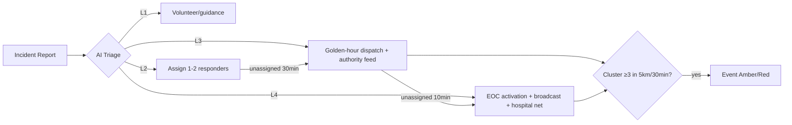
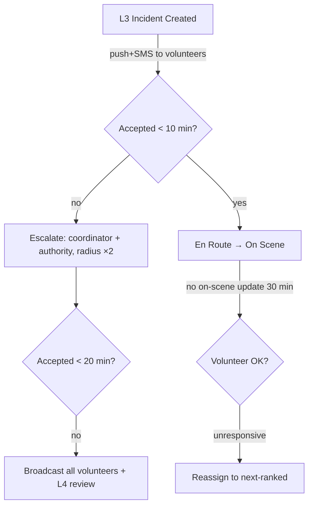
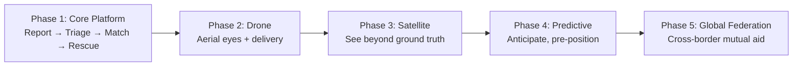

# AIDRA — Advanced Product & Operations Supplement (PRD Volume II)

**Product:** AIDRA — AI-Powered Disaster Response Platform
**Tagline:** "Connecting Help Before It's Too Late."
**Version:** 1.0 · **Date:** September 25, 2026 · **Status:** Production-ready supplement
**Companion docs:** [PRD.md](./PRD.md) (core requirements) · [DESIGN-SYSTEM.md](./DESIGN-SYSTEM.md) (locked UI)

> This volume adds the enterprise-grade PM sections: vision, business goals, KPIs, severity framework, AI system specs, acceptance criteria, escalation matrix, playbooks, risk management, analytics, compliance, and future roadmap. It does not replace PRD.md — it extends it.

---

## 1. Product Vision

### 1.1 Vision Statement
**A world where no life is lost because help arrived late.** Every person in a disaster — regardless of language, wealth, or connectivity — is seen, prioritized, and reached within the golden hour.

### 1.2 Mission Statement
AIDRA uses AI to connect victims, volunteers, NGOs, hospitals, and authorities into one real-time coordination network — turning fragmented crisis signals into fast, fair, life-saving action.

### 1.3 Long-Term Goal (5–7 years)
- Become the **default disaster coordination layer** in 10+ disaster-prone countries, integrated with national emergency systems (e.g., NDMA/SDMA in India, FEMA in the US).
- Save a measurable, auditable **10,000+ lives** via reduced response times (modeled against baseline benchmarks).
- Build the world's largest **verified responder network**: 1M+ trained volunteers, 50k+ NGOs/hospitals.
- Achieve **predictive readiness**: disasters anticipated days ahead with resources pre-positioned.

### 1.4 North Star Metric
**Golden-Hour Rescue Rate (GHRR):**
> % of Critical/High-urgency incident reports where a verified responder is **On Scene within 60 minutes** of report creation.

- **Formula:** `GHRR = (# Critical/High incidents with first On-Scene status ≤ 60 min) ÷ (all Critical/High incidents) × 100`
- **Current baseline (manual systems):** ~35–45%. **v1 target: 65%. 3-year target: 85%.**
- Why it's the North Star: it compresses the entire value chain — reporting, triage, matching, routing, coordination — into one outcome investors, governments, and victims all understand: *help arrived in time*.

**Supporting counter-metric (guardrail):** False-Dispatch Rate < 5% (speed must never come at the cost of accuracy).

---

## 2. Business Goals

### 2.1 Six-Month Goals (Pilot Phase)
| # | Goal | Measurable Target |
|---|---|---|
| BG-1 | Complete pilot deployment in 1 district with a government EOC partner | 1 district live, MoU signed |
| BG-2 | Prove core rescue loop | GHRR ≥ 55% in pilot region |
| BG-3 | Build responder supply | 2,000 verified volunteers, 25 NGOs, 15 hospitals onboarded |
| BG-4 | Validate AI triage | ≥ 75% triage agreement with expert ground truth |
| BG-5 | Reliability | 99.5%+ uptime incl. 2 live disaster-season events with zero critical failures |
| BG-6 | Funding readiness | Seed round ($1–2M) or grant (e.g., government/UN innovation fund) closed |

### 2.2 One-Year Goals
| # | Goal | Measurable Target |
|---|---|---|
| BG-7 | 5 districts / 1 state-level deployment | 5 districts, 1 state dashboard |
| BG-8 | Scale network | 20k volunteers, 100 NGOs, 75 hospitals |
| BG-9 | Incident throughput | 100k reports processed; 25k incidents resolved |
| BG-10 | GHRR | ≥ 65% sustained across regions |
| BG-11 | Revenue engine live | 2 government/authority SaaS contracts + 1 CSR-funded NGO tier |
| BG-12 | Multilingual scale | 8 languages live; 90%+ reports in victim's language |

### 2.3 Three-Year Goals
| # | Goal | Measurable Target |
|---|---|---|
| BG-13 | Multi-country presence | 3 countries; 1 national-level integration |
| BG-14 | Network scale | 1M volunteers, 10k organizations, 5M citizens protected |
| BG-15 | GHRR | ≥ 85% |
| BG-16 | Predictive capability | Pre-positioning alerts ≥ 48h ahead for cyclone/flood classes (with partner data) |
| BG-17 | Financial sustainability | $8–12M ARR from government SaaS + CSR + insurance partnerships; 12-month runway at all times |
| BG-18 | Ecosystem | Open API adopted by 20+ third-party rescue/relief tools |

---

## 3. Success Metrics & KPIs

### 3.1 Victim Experience
| Metric | Formula | Target | Tracking Method |
|---|---|---|---|
| Report Submission Time | Time from app open → report submitted (median) | < 60s | Client-side telemetry events |
| SOS Success Rate | Reports synced successfully ÷ reports created | ≥ 99% | Sync outbox logs |
| Time-to-First-Update | Report created → victim receives "help assigned" notification (median) | < 5 min | Event pipeline timestamps |
| Resolution Awareness | Victims who receive resolution notification ÷ resolved incidents | ≥ 95% | Notification service logs |
| Language Match Rate | Reports where UI language = user's selected language | ≥ 98% | Analytics events |
| Victim CSAT | Post-resolution in-app survey (1–5) | ≥ 4.2 | Survey microservice |

### 3.2 Volunteer Operations
| Metric | Formula | Target | Tracking Method |
|---|---|---|---|
| Assignment Acceptance Rate | Accepted ÷ offered assignments | ≥ 60% | Assignment service |
| Accept-to-Dispatch Time | Assignment offered → accepted (median) | < 3 min | Event timestamps |
| On-Scene Rate | Assignments reaching On-Scene ÷ accepted | ≥ 90% | Status lifecycle |
| Match Precision@1 | Top-ranked volunteer accepts ÷ top-ranked offers | ≥ 65% | Matching engine logs |
| Volunteer Retention (90d) | Volunteers active after 90d ÷ onboarded | ≥ 40% | Cohort analysis |
| False Availability Rate | Volunteers marked available but unreachable ÷ total | < 8% | Heartbeat + assignment outcomes |

### 3.3 Hospital Coordination
| Metric | Formula | Target | Tracking Method |
|---|---|---|---|
| Capacity Data Freshness | Hospitals updating capacity within last 30 min ÷ total | ≥ 85% during events | Capacity registry |
| Pre-Alert Lead Time | Pre-alert sent → patient arrival (median) | ≥ 20 min | Hospital module |
| Routing Accuracy | Casualties delivered to hospital with matching capacity ÷ total | ≥ 95% | Assignment vs capacity audit |
| Diversion Rate | Patients redirected after arrival due to full capacity | < 5% | Hospital feedback API |
| Trauma Team Readiness | Pre-alerts acknowledged within 5 min | ≥ 90% | Ack workflow logs |

### 3.4 NGO Coordination
| Metric | Formula | Target | Tracking Method |
|---|---|---|---|
| Coverage Overlap Rate | Area served by >1 NGO ÷ total areas (lower is better) | < 10% | Coverage map analysis |
| Request Fulfillment Time | NGO resource request → dispatch confirmed (median) | < 45 min | Resource workflow |
| Inter-Org Response Rate | Cross-NGO requests accepted | ≥ 70% | Request board logs |
| De-duplication Savings | Duplicate deployments prevented ÷ attempted | ≥ 25% | Merge/dedup audit |

### 3.5 Resource Management
| Metric | Formula | Target | Tracking Method |
|---|---|---|---|
| Inventory Accuracy | Physical stock = system stock (audit) | ≥ 98% | Cycle counts + transactions |
| Stockout Rate | Critical items stocked out while demand existed | < 3% | Forecast vs transaction audit |
| Burn-Rate Forecast Error | MAPE of 24h consumption forecast | < 15% | Forecasting engine eval |
| Redistribution Efficiency | Surplus moved to deficit sites within 12h | ≥ 80% | Transfer workflows |

### 3.6 AI Performance
| Metric | Formula | Target | Tracking Method |
|---|---|---|---|
| Triage Agreement | AI urgency = expert urgency | ≥ 85% (v1: 75%) | Weekly labeled audit set |
| Critical Recall | Critical incidents correctly flagged ÷ all Critical | ≥ 95% (non-negotiable) | Eval harness |
| Triage Latency | Report → triage score (p95) | < 10s | Inference logs |
| Matching Precision@3 | At least one top-3 match accepts | ≥ 80% | Matching logs |
| Route Safety Score | Routes without hazard exposure ÷ routes served | ≥ 99% | Routing engine + closure feed audit |
| Demand Forecast MAPE | Food/water/medicine demand error | < 20% | Backtests |
| Model Drift Alert Time | Drift detected within | < 24h | Monitoring (PSI, KS tests) |

### 3.7 Platform Reliability
| Metric | Formula | Target | Tracking Method |
|---|---|---|---|
| Uptime | Successful requests ÷ total (monthly) | ≥ 99.9% | SLO dashboards |
| Offline Sync Success | Queued mutations applied ÷ queued | ≥ 99% | Sync service |
| Notification Delivery | Delivered ÷ sent within 30s | ≥ 98% | Push/email provider webhooks |
| MTTR | Mean time to restore service after Sev-1 | < 30 min | Incident tooling |
| Map Tile Load | p95 tile load time | < 2s | RUM telemetry |
| Data Loss Incidents | Unrecoverable user data events | 0 | Audit + backup verification |

---

## 4. Disaster Severity Framework

AIDRA uses a **4-level severity matrix** applied at two layers: (a) per-incident urgency, (b) event-level emergency class. AI triage proposes the level; authorities can adjust; all escalations run automatically per the matrix.

### 4.1 Severity Matrix

| Dimension | **Level 1 — Low** | **Level 2 — Moderate** | **Level 3 — High** | **Level 4 — Critical** |
|---|---|---|---|---|
| **Description** | Minor hazard, no immediate danger to life; individual can self-manage | Localized danger; small number of people at risk; manageable by 1–2 responders | Serious threat to life/property; multiple victims; significant resource need | Mass-casualty or life-threatening event; large population at risk; systemic breakdown |
| **Examples** | Minor injury, stranded vehicle, well-waterlogging, small fire contained | 1–5 people trapped, road blockage isolating a locality, moderate flooding of streets, medical emergency (non-critical) | Building collapse, flash flood, people swept away, fire spreading, casualty event, medical emergency (critical) | Dam breach, major earthquake, cyclone landfall, city-wide flooding, wildfire encroaching settlements, mass casualties (10+) |
| **Expected Response Time** | First action < 4 hours; resolution < 24h | Responder assigned < 30 min; On-Scene < 2h | Responder assigned < 10 min; On-Scene < 60 min (golden hour) | Assigned < 5 min; multi-team dispatch < 15 min; authority activation < 10 min |
| **Escalation Rules** | Auto-close after 24h if no follow-up; escalate to L2 if AI/victim raises urgency | If unassigned > 30 min → notify area coordinator; > 2h → escalate L3 review | If unassigned > 10 min → auto-escalate to authority + re-match radius expanded; > 30 min → L4 review | Immediate: EOC alert, all-hands broadcast, 5× matching radius, hospital pre-alerts, senior authority dashboard banner |
| **Resource Requirements** | 1 volunteer or guidance only | 1–2 volunteers; basic first-aid/rescue kit | 3–10 responders incl. skilled (medical/rescue); vehicle; possible hospital standby | Multi-agency: NDRF-type teams, ambulances, hospital network, NGO supply chain, authority command |
| **Notification Set** | Assigned responder only | Responder + local coordinator | Responder + coordinator + hospital (if medical) + authority feed | All responders in radius + EOC + hospital network + public broadcast (multilingual) |
| **Map Presentation** | Grey/green pin | Orange pin | Red pin | Deep-red pin + radar pulse + summary card |

### 4.2 Event-Level Classification
When ≥ 3 L3+ incidents cluster within 5 km in 30 min, AIDRA raises an **Event** (AI cluster detection, FR-203):
- **Event Amber:** localized cluster — dedicated coordinator assigned, resources flagged.
- **Event Red:** district-scale — EOC activates Command Center view, broadcasts enabled, resource forecasting engaged.

---

## 5. AI System Requirements

Common requirements: every AI output carries a **confidence score**; every AI decision is **logged with model version + input snapshot** (auditability, §11); human-in-the-loop override for L3+; models are versioned, evaluated offline before deploy, and monitored for drift.

### 5.A Urgency Detection Engine

| Aspect | Specification |
|---|---|
| **Purpose** | Classify each report's severity (L1–L4), extract structured facts, flag critical cases for immediate dispatch |
| **Inputs** | Text (description, ≤500 chars, multilingual EN/HI/TE/TA); Images (damage/trapped-persons imagery); Audio (voice report → ASR → text); Metadata (location context, time, reporter history, nearby-report density) |
| **Outputs** | Severity Score (0–1 continuous + L1–L4 class); Confidence Score (0–1); Extracted entities: victim count, injury type, hazard type, location mentions; Duplicate similarity score vs recent reports |
| **Model Type** | Multilingual sentence-transformer (e.g., IndicBERT/XLM-R fine-tune) + gradient-boosted meta-classifier fusing text score, image CNN/ViT classifier, ASR transcript, metadata; rule layer for hard constraints (e.g., "trapped" + "children" ≥ L3) |
| **Training Data** | Historical incident reports (partner NGO/EOC archives, public social-media disaster corpora like CrisisNLP/CrisisMMD, synthetic augmentation for rare classes, human-labeled by domain experts) |
| **Evaluation Metrics** | Macro-F1, Critical-class Recall (priority), Precision, calibration (ECE), per-language F1 parity (±5%) |
| **Accuracy Targets** | Critical Recall ≥ 95%; overall triage agreement ≥ 85% (v1 gate: 75%); inference < 10s p95; false-Critical rate < 3% |

### 5.B Volunteer Matching Engine

| Aspect | Specification |
|---|---|
| **Purpose** | Rank volunteers per incident to maximize accept-rate and on-scene success |
| **Inputs** | Volunteer location (live), skills taxonomy (medical/rescue/logistics/technical), availability status, current load, rating/history; Incident urgency, location, required skills; Route-adjusted travel time (not straight-line) |
| **Outputs** | Ranked list (top 10): volunteer, match score (0–1), distance, ETA, skill-match breakdown; Auto-offer set (top 3); escalation candidate list |
| **Model Type** | Learning-to-rank (e.g., LambdaMART/LTR on historical assignment outcomes) over hard-filter candidate set (geo + availability); cold-start heuristic (distance+skill) for new volunteers |
| **Training Data** | Assignment lifecycle logs (offered/accepted/en-route/on-scene outcomes), volunteer profiles, incident histories |
| **Evaluation Metrics** | Precision@1/@3, acceptance rate, time-to-accept, on-scene conversion, fairness (no demographic skew — audited) |
| **Accuracy Targets** | Precision@3 ≥ 80%; top-match acceptance ≥ 65%; ranking compute < 1s for 10k candidates |

### 5.C Route Intelligence Engine

| Aspect | Specification |
|---|---|
| **Purpose** | Compute safest (not just fastest) routes for responders and evacuees |
| **Inputs** | Road network graph + real-time road status (open/blocked/damaged from reports FR-602 + authority feeds); Traffic data (provider API); Flood data (sensor reports, imagery-derived water maps, hydrology APIs); Weather nowcast (rain intensity, wind, visibility) |
| **Outputs** | Primary safe route: geometry, distance, ETA (e.g., "2.8 km · 8 min"), hazard-avoidance explanation; Alternative routes; Reroute triggers (hazard intersects active route) |
| **Model Type** | Deterministic constrained shortest-path (A*/Dijkstra on cost function = travel time × hazard penalty multipliers) + ML hazard-penalty predictor (gradient boosting on road-segment features); no generative components on safety-critical path |
| **Training Data** | Historical road closure/impact datasets, past disaster road-failure records, provider traffic archives |
| **Evaluation Metrics** | Route safety score (hazard exposure = 0 target), ETA error vs actual (MAE), reroute latency |
| **Accuracy Targets** | 0 hazard exposure on served routes (hard guarantee via closure filtering); ETA MAE < 20%; reroute pushed < 30s after hazard confirmed |

### 5.D Resource Forecasting Engine

| Aspect | Specification |
|---|---|
| **Purpose** | Predict demand for food, water, medicine, shelter; pre-position supplies; prevent stockouts |
| **Inputs** | Active incident streams (type, urgency, location, victim counts from AI triage); Event class (§4.2); Population/density baselines; Historical consumption per disaster type; Supply inventory + in-transit stock; Weather/hydrological forecasts |
| **Outputs** | Per-region 24h/72h demand forecasts (food-meals, water-liters, medicine-units by category, shelter-capacity); Stockout risk alerts; Redistribution recommendations (site A → site B, quantity) |
| **Model Type** | Hierarchical time-series (per region × resource) with covariate regression (gradient boosting) + scenario simulation on event-class priors; simple, explainable baselines always compared |
| **Training Data** | Historical relief consumption datasets (NGO partners, government releases), past AIDRA transactions (grows over time), census/density data |
| **Evaluation Metrics** | MAPE per resource, stockout-avoidance rate, bias (over- vs under-provisioning cost) |
| **Accuracy Targets** | MAPE < 20% (24h) in pilot; ≥ 80% of stockouts avoided vs baseline; forecast refreshed hourly |

### 5.E AI Governance (cross-cutting)
- Human confirmation required for any AI-driven Critical escalation to trigger public broadcasts.
- Bias audit quarterly: triage/matching outcomes across language, gender, geography.
- Kill-switch: revert to rules-only triage within 5 minutes if model confidence degrades (drift monitor).
- Every prediction stored with `model_version` + inputs hash → reproducible post-incident review.

---

## 6. Acceptance Criteria (Given / When / Then)

### 6.1 Emergency Reporting
- **AC-R1:** **Given** a victim on the Report screen, **When** they select Text tile, type ≤500 chars, and tap Submit, **Then** the report is created with GPS location, appears on the authority feed within 5s, and the victim sees a confirmation with report ID.
- **AC-R2:** **Given** a victim chooses Voice tile, **When** they record ≤30s audio, **Then** audio uploads, ASR transcript is attached, and AI triage runs on the transcript.
- **AC-R3:** **Given** the device has no connectivity, **When** a report is submitted, **Then** it is stored in the local outbox with original timestamp, user sees "will send when online", and it syncs automatically within 30s of reconnection.
- **AC-R4:** **Given** a user selects urgency "Critical", **When** they submit, **Then** the report is flagged for priority processing and the authority feed shows it with Critical styling within 5s.

### 6.2 AI Triage
- **AC-T1:** **Given** a new report, **When** triage completes, **Then** severity score, confidence, and extracted entities are attached within 10s and visible on the incident detail drawer.
- **AC-T2:** **Given** AI assigns Critical with confidence ≥ 0.8, **When** no authority action occurs within 5 min, **Then** the system auto-escalates per §7 matrix.
- **AC-T3:** **Given** AI urgency conflicts with user urgency by ≥2 levels, **When** triage completes, **Then** the report is queued for human verification and never auto-closed.
- **AC-T4:** **Given** two reports within 300m and 30min with similarity ≥ 0.85, **When** both are processed, **Then** duplicate detection suggests a merge to the authority (never auto-merges).

### 6.3 Volunteer Assignment
- **AC-V1:** **Given** a verified L3 incident, **When** matching runs, **Then** top-10 ranked volunteers with distance/ETA appear within 3s and the "Best Match Found" banner renders when ≥3 matches are within 2 km.
- **AC-V2:** **Given** an authority taps Assign on a volunteer, **When** the volunteer accepts, **Then** status moves to En Route, the victim is notified, and the recommended route card displays distance + ETA.
- **AC-V3:** **Given** an offered assignment with no acceptance for 10 min (L3), **When** the timer elapses, **Then** the system re-matches to the next tier and notifies the area coordinator.

### 6.4 NGO Coordination
- **AC-N1:** **Given** an NGO coordinator on the coverage map, **When** they draw/claim an area, **Then** the map shows their coverage and flags overlaps with other NGOs.
- **AC-N2:** **Given** an NGO posts a resource request, **When** another NGO approves, **Then** both see dispatch status and the transaction is recorded with actor + timestamp.

### 6.5 Hospital Coordination
- **AC-H1:** **Given** a hospital updates capacity to ICU=0, **When** casualty routing runs, **Then** that hospital is excluded from AI-suggested assignments and marked "Full" on the dashboard.
- **AC-H2:** **Given** an inbound casualty group (n=4, ETA 18 min), **When** a pre-alert is sent, **Then** the hospital dashboard shows count, triage tags, ETA, and an acknowledge button with 5-min SLA tracking.

### 6.6 Resource Tracking
- **AC-RES1:** **Given** any resource transaction (dispatch/consume/transfer), **When** recorded, **Then** inventory updates in real time and the audit log captures actor, delta, reason.
- **AC-RES2:** **Given** forecasted 24h demand exceeds stock at a distribution point, **When** the forecast refreshes, **Then** a low-stock alert is raised with redistribution recommendation.

### 6.7 Live Maps
- **AC-M1:** **Given** the Live Map is open, **When** incidents/volunteers/hospitals/resources change, **Then** pins update via WebSocket within 2s without page refresh.
- **AC-M2:** **Given** a Critical cluster (≥3 L3+ within 5 km), **When** detected, **Then** the map shows the radar pulse and incident summary card.
- **AC-M3:** **Given** the legend, **When** a user toggles a layer, **Then** only that pin class shows/hides.

### 6.8 Notifications
- **AC-NOT1:** **Given** any notification-worthy event, **When** triggered per §7 matrix, **Then** all targeted users receive it via primary channel within 30s (p95).
- **AC-NOT2:** **Given** a Critical broadcast, **When** a user has quiet hours enabled, **Then** the notification still delivers (Critical bypasses quiet hours).
- **AC-NOT3:** **Given** push delivery fails twice, **When** fallback executes, **Then** SMS/email fallback is attempted and the failure is logged.

### 6.9 Offline Mode
- **AC-O1:** **Given** offline state, **When** the volunteer opens their assigned tasks, **Then** cached task details, route snapshot, and incident summary render with an "offline — last updated X" indicator.
- **AC-O2:** **Given** queued mutations from offline, **When** connectivity returns, **Then** sync applies them in original order with idempotency (no duplicates) and surfaces conflicts for user choice.

### 6.10 Multilingual Support
- **AC-L1:** **Given** a user selects Hindi/Telugu/Tamil/Spanish/English, **When** any screen loads, **Then** all static UI strings render in that language with no placeholders.
- **AC-L2:** **Given** a report in Tamil, **When** a responder views it with a different language, **Then** a translated summary is shown with the original text preserved.
- **AC-L3:** **Given** a broadcast composed in English, **When** sent to a multilingual area, **Then** recipients receive it in their selected language.

---

## 7. Notification & Escalation Matrix

### 7.1 Event → Notification Matrix

| Trigger Event | Recipients | Channels | Priority | Delivery SLA |
|---|---|---|---|---|
| Report submitted | Authority feed, area coordinator | Dashboard, in-app | P3 | 60s |
| L3 incident created | Nearest skilled volunteers, coordinator, authority | Push + SMS + dashboard | P1 | 30s |
| L4 incident created | All responders in 10 km, EOC, hospital net | Push + SMS + dashboard + siren-template broadcast | P0 | 15s |
| Assignment offered | Volunteer | Push | P1 | 30s |
| Assignment accepted | Victim, authority, coordinator | Push, dashboard | P2 | 30s |
| Status change (en route/on scene/resolved) | Victim, authority, coordinator | Push, dashboard | P3 | 30s |
| No-accept escalation (L3 > 10 min) | Coordinator, authority, wider volunteer ring | Push + SMS | P1 | 30s |
| Hospital capacity critical (ICU=0) | Hospital admin, authority, routing engine | Dashboard + push | P1 | 30s |
| Casualty pre-alert | Hospital coordinator | Push + dashboard + email | P1 | 30s |
| Low stock forecast | NGO coordinator, authority logistics | Dashboard + email | P2 | 5 min |
| Broadcast (area alert) | All users in polygon | Push + SMS + in-app banner | P0/P1 | 15s (P0) |
| Reroute (hazard on active route) | Affected responders | Push with new route | P1 | 30s |
| System Sev-1 (platform degradation) | Operations team, authority admins | Pager, email, status banner | P0 | 60s |

**Priority levels:** P0 = life-safety, bypass quiet hours, multi-channel with retry; P1 = operational urgency; P2 = standard; P3 = informational (digest-eligible).

### 7.2 Escalation Timing & Fallbacks

| Condition | Escalation | Fallback Action |
|---|---|---|
| L3 unassigned > 10 min | Notify coordinator + authority; expand matching radius ×2 | Auto-re-match; mark as "escalated" on dashboard |
| L3 unassigned > 30 min | Raise to authority L4 review | Broadcast to all volunteers regardless of skill match |
| L4 unassigned > 5 min | EOC direct alert (phone bridge) | Trigger partner-agency webhook (e.g., 108/911-style integration) |
| Volunteer unresponsive post-accept > 15 min | Reassign; flag availability reliability | Next-ranked volunteer auto-offered |
| Hospital pre-alert unacknowledged > 5 min | Secondary hospital auto-suggested | Routing engine re-targets; authority notified |
| Push delivery failure ×2 | SMS fallback | Email fallback; log delivery gap for ops |
| Broadcast API degraded | Direct SMS gateway | Partner government SMS channel |
| Sync conflict (offline) | User choice prompt | Server timestamp authority for status fields; never silent-overwrite victim reports |

---

## 8. Disaster Playbooks

Operational workflows auto-instantiated when the AI cluster detector or authority classifies an event type. Each playbook configures default severity thresholds, resource templates, notification sets, and dashboard views.

### 8.1 Flood Playbook
| Phase | Actions |
|---|---|
| **Detection** | Weather/hydrology API thresholds (rainfall > 100mm/24h, river level warnings) + report clustering ("water rising", flood imagery) → propose Event Amber |
| **Assessment** | AI extracts water-depth/extent mentions; map flooded zones; population-in-area estimate; L4 auto-suggested if cluster > 20 L3 reports/hr |
| **Resource Allocation** | Activate flood template: boats, life-jackets, water purification, dry food, shelter kits; forecasting engine projects 72h demand per zone |
| **Volunteer Deployment** | Prioritize boat-trained + swimmers; staging areas auto-suggested on high ground; safe routes avoid water-reported segments |
| **Hospital Coordination** | Pre-position trauma/waterborne-disease capacity; casualty pre-alerts for trapped/drowned cases; dialysis/chronic-care patient locator (registry flag) |
| **Recovery** | Disease-outbreak watch (AI monitors symptom keywords); damage assessment reports; shelter occupancy management; transition to NGO coverage map |

### 8.2 Cyclone Playbook
| Phase | Actions |
|---|---|
| **Detection** | Meteorological feed (track + landfall ETA); auto Event Red ≥ 48h before landfall when track intersects protected area |
| **Assessment** | Pre-landfall: exposure model (population × wind zones); Post-landfall: report ingestion resumes as comms return |
| **Resource Allocation** | Pre-position 72h supplies at shelters; generator fuel, tarpaulins, chainsaws; forecasting prioritized on pre-event window |
| **Volunteer Deployment** | **Pre-landfall:** no field dispatch — shelter management only. **Post-landfall:** rescue + debris-clearance teams staged at district hubs |
| **Hospital Coordination** | Capacity snapshot locked and broadcast pre-landfall; post-landfall casualty distribution per §7 pre-alert flow |
| **Recovery** | Roofing/power restoration coordination with authorities; compensation-documentation export (photos + geotags); 30-day health surveillance |

### 8.3 Earthquake Playbook
| Phase | Actions |
|---|---|
| **Detection** | Seismic network API trigger (M ≥ 4.5) → instant Event Red; "felt report" surge validation within 60s |
| **Assessment** | Shake-map overlay × building-vulnerability baselines → priority search zones; AI processes collapse imagery + "trapped" keyword spike |
| **Resource Allocation** | Urban search-and-rescue template: concrete cutters, sniffer-dog teams (partner), heavy-lift requests to authorities, medical surge |
| **Volunteer Deployment** | Trained SAR volunteers only in collapse zones (untrained volunteers routed to periphery tasks: logistics, first-aid points); aftershock pause protocol auto-broadcasts |
| **Hospital Coordination** | Mass-casualty mode: capacity grid live-lock, casualty distribution across network, blood-bank network activation |
| **Recovery** | Structural-damage tagging; displaced-persons shelter registry; reunification module (missing-persons matching) |

### 8.4 Wildfire Playbook
| Phase | Actions |
|---|---|
| **Detection** | Satellite fire-pixel feed + report keywords (smoke, flames) + air-quality sensor spikes → Event Amber |
| **Assessment** | Fire-spread nowcast (partner model) × wind direction → 6h exposure zones; evacuation-priority ordering |
| **Resource Allocation** | Evacuation transport, N95/air-purifier distribution, water tankers; shelter capacity with clean-air requirement flag |
| **Volunteer Deployment** | Evacuation support + traffic marshalling only — **no volunteer firefighting** (policy); routes avoid downwind segments |
| **Hospital Coordination** | Respiratory/burn capacity flags; pre-alerts carry exposure type; vulnerable-population registry (oxygen-dependent) prioritized |
| **Recovery** | Air-quality based return-home advisories; property-damage documentation; ecological partner handoff |

### 8.5 Landslide Playbook
| Phase | Actions |
|---|---|
| **Detection** | Rainfall-intensity thresholds on slopes + report clustering ("hillside", "debris") + seismograph correlation |
| **Assessment** | Slope-stability risk zones (geology baselines); buried-victim search-sector estimation from last-known-location data |
| **Resource Allocation** | Excavator requests to authorities, shoring equipment, medical trauma surge; forecasting sized on affected-village populations |
| **Volunteer Deployment** | Hill-trained rescue teams; equipment operators registry; route intelligence flags unstable approach roads as blocked |
| **Hospital Coordination** | Trauma + crush-injury protocol pre-alerts; dialysis capacity check (crush syndrome) |
| **Recovery** | Slope-monitoring advisory period (30d reactivation watch); rehabilitation coordination; geologist partner reporting |

**Playbook mechanics (engineering):** each playbook = JSON config (severity rules, resource template, notification matrix overlay, dashboard preset, recovery checklists) selected manually by authority or auto-proposed by event classifier; all playbook actions are auditable and reversible.

---

## 9. Risk Management Framework

Scale: Probability / Impact — L (low), M (medium), H (high).

### 9.1 Technical Risks
| Risk | Impact | Probability | Mitigation |
|---|---|---|---|
| Connectivity blackout in disaster zone makes platform unusable | H | H | Offline-first architecture (FR-10xx) from day 1; SMS/mesh fallback (roadmap); cached maps/tasks |
| Map/routing provider outage or cost spike during event | H | M | Dual-provider abstraction (Google + Mapbox/OSM); OSM tile self-host fallback; usage caps + caching |
| 10× traffic surge crashes platform at worst moment | H | H | Auto-scaling + load tests to 100k sessions (Phase 3); read-replica fan-out; queue-based ingestion with backpressure |
| WebSocket fan-out lag breaks real-time map | M | M | Redis pub/sub sharding; degradation to 15s polling fallback; SLO alerting |
| Mobile battery/GPS drain kills volunteer availability | M | M | Adaptive location sampling (motion-aware), battery-optimized modes |
| Data loss during offline sync conflicts | H | M | Idempotency keys, CRDT-style conflict rules, sync test suite, server-authoritative status fields |

### 9.2 Operational Risks
| Risk | Impact | Probability | Mitigation |
|---|---|---|---|
| Volunteers don't show/accept (adoption failure) | H | H | Gamification + certification partnership, CSR corporate volunteer programs, escalation matrix guarantees coverage |
| NGO/hospital data staleness during crisis | M | H | Freshness SLOs (§3.3), 30-min update nudges, authority can mark stale |
| Duplicate/conflicting authority processes (platform vs manual) | M | H | Pilot co-design with EOC; AIDRA as overlay, not replacement; export to government formats |
| Onboarding friction kills signups during calm periods | M | M | 3-tap signup, drills/simulations as engagement, standby rosters |
| 24×7 ops team burnout during prolonged events | M | M | War-room rotation runbooks, automation of escalations, on-call stipends |

### 9.3 Security Risks
| Risk | Impact | Probability | Mitigation |
|---|---|---|---|
| Location data breach endangers victims/attackers misuse | H | M | Field-level encryption, ±500m blurring (non-assigned), 90d purge, least-privilege access |
| Fake reports cause misdirected resources (adversarial) | M | H | Verification workflows, rate limits, fraud heuristics, reporter reputation, cluster corroboration |
| Account takeover of responder accounts | H | M | MFA for responders, device binding, anomaly-based re-auth |
| Insider misuse of victim data | H | L | Hash-chained audit logs, access reviews, DSR tooling, need-to-know RBAC |
| DDoS during a live disaster event | H | M | WAF + CDN + DDoS protection, static status page, multi-AZ |

### 9.4 AI Risks
| Risk | Impact | Probability | Mitigation |
|---|---|---|---|
| Critical case missed by AI (false negative) | H | M | Rules-layer hard constraints; Critical Recall ≥ 95% gate; human verification on low confidence; kill-switch to rules-only |
| False Critical flood of misdirected resources | M | M | False-Critical < 3% target; authority confirmation for public broadcasts |
| Language bias (underperformance in regional languages) | M | M | Per-language F1 parity gates (±5%); regional-language eval sets; native-speaker labeling |
| Model drift post-deployment | M | H | Daily drift monitors (PSI/KS), weekly labeled audits, automated rollback |
| Matching bias (demographic skew) | H | L | Fairness audits quarterly; score-blind review; diverse training data |
| Over-reliance on AI by authorities | M | M | Confidence display, explanation notes, mandatory human confirm for L4 broadcasts |

### 9.5 Disaster-Specific Risks
| Risk | Impact | Probability | Mitigation |
|---|---|---|---|
| AIDRA's own infra region hit by the disaster | H | L | Multi-AZ + cross-region DR (RTO ≤ 30 min, RPO ≤ 5 min); cell-broadcast-independent channels (SMS) |
| Power/telecom grid collapse at scale | H | H | Offline clients, SMS gateway, partner satellite-comms (Phase 3), low-bandwidth mode |
| Mass-casualty event exceeds matching capacity | H | M | Multi-agency handoff (NDRF/108 integration webhooks), event-red auto-policies |
| Simultaneous multi-hazard events (cyclone + flood) | M | M | Playbook stacking design; event-class model supports composite modes |
| Secondary hazards (aftershocks, disease outbreak) | M | M | Recovery-phase monitoring modules in each playbook (§8) |

---

## 10. Analytics & Reporting Framework

### 10.1 Dashboard Specifications

| Audience | Real-Time Widgets (KPIs) | Charts | Refresh |
|---|---|---|---|
| **Authorities (Command Center)** | Active Incidents, People in Need, Volunteers Active, Resources Available, GHRR (live), Event level | Live map + heatmap, incident trend (24h), severity mix donut, response-time percentiles, resource burn gauge | 10–30s |
| **NGOs** | My Deployments, Requests Open/Accepted, Coverage Overlap, Stock Alerts | Coverage map, request funnel, consumption by category, volunteer availability curve | 60s |
| **Hospitals** | Beds/ICU/Blood/Oxygen live grid, Inbound Casualties (ETA queue), Pre-Alert Ack SLA | Capacity timeline, casualty flow (arrival rate), diversion trend | 30s |
| **Operations Team (internal)** | Uptime/SLO burn, Sync success, Triage latency p95, Notification delivery %, Drift monitors, Error budgets | Service dashboards, alert history, per-region health, model performance panels | 15s |

### 10.2 Reports
| Report | Cadence | Audience | Contents |
|---|---|---|---|
| Daily Operations Brief | Daily 07:00 local | Authority, ops | New/resolved incidents, GHRR, escalations raised, stock alerts, notable AI flags |
| Incident Post-Report | Auto per L4 event | All stakeholders | Timeline reconstruction (report→dispatch→on-scene→resolved), AI decisions log, response-time breakdown |
| Weekly Performance | Weekly | NGO/hospital partners | Their org's KPIs vs targets, benchmark percentile, improvement actions |
| Weekly Model Audit | Weekly | AI/ops + authority | Triage agreement, per-language F1, drift status, override rates |
| Executive/Monthly | Monthly | Investors/government | Impact metrics (lives reached, GHRR trend), growth, reliability, roadmap status |
| Compliance Export | On demand | Auditors/regulators | Audit-log extracts, consent records, retention proofs (signed, immutable) |

**Implementation:** event pipeline → OLAP store (time-series + warehouse) → dashboard layer; all metrics defined as code (metric registry) so PRD targets (§3) map 1:1 to production queries.

---

## 11. Compliance & Governance

### 11.1 Data Privacy
- **Regulatory alignment:** India DPDP Act 2023, GDPR principles for international expansion, local emergency-services data directives.
- **Lawful basis:** vital-interest + consent (victims), contract/consent (volunteers), public-task (authorities). Consent captured at onboarding per purpose; granular toggles for non-essential processing.
- **Data minimization:** collect only what triage/matching/routing require; precise location rules per PRD §9.4 (blur ±500m except assigned responder).
- **DSR:** self-service export + deletion endpoints; deletion honored except legally-mandated incident records (pseudonymized).

### 11.2 Audit Logging
- Append-only, hash-chained audit log (tamper-evident) for: every report edit, merge, assignment, status change, capacity change, broadcast, admin action, AI decision (model version + inputs hash), and data export.
- Logs include actor, role, entity, before/after, IP, device, timestamp (UTC). Retention: 7 years for incident-linked records; 90 days for raw PII (pseudonymized thereafter).
- Audit-log access itself is logged; read-only for admins; immutable storage (WORM).

### 11.3 Consent Management
- Consent ledger: purpose, timestamp, UI version, language. Withdrawal honored within 24h for analytics/notifications; location processing stops immediately on disable.
- Minors: under-18 accounts require guardian-linked consent; children's data never used for model training.
- Volunteer verification documents: encrypted, access-limited, purged after approval + 90d.

### 11.4 Data Retention
| Data Class | Active Retention | Post-Event |
|---|---|---|
| Victim PII + precise locations | During incident + 90d | Pseudonymize, then purge PII |
| Incident records (de-identified) | 7 years | Retained for audit/learning |
| Media (photos/video/audio) | 90d | Deleted unless flagged legal-hold |
| Audit logs | 7 years | Immutable archive |
| Model training data | Aggregated/de-identified only | Quarterly purge review |

### 11.5 Disaster Reporting Compliance
- Support government-mandated formats: situation reports (SITREP) exports matching NDMA/SDMA templates; daily authority briefs auto-generated (§10.2).
- Interoperability: CAP (Common Alerting Protocol) format support for public broadcasts; webhook/API handoff to 108/112-style emergency numbers (per PRD §7 fallbacks).
- Data residency: regional deployment option (India data stays in India region); residency configurable per tenant.
- Accountability: designated Data Protection Officer; incident-breach notification within 72h; annual third-party security audit + public trust report.

### 11.6 Governance Structure
- **AI Review Board** (internal + external expert): approves model deploys, audits bias/fairness quarterly.
- **Safety Committee:** reviews every L4 post-incident report; owns playbook updates.
- **Change control:** production model/policy changes require review sign-off + rollback plan.

---

## 12. Future Expansion Roadmap

### Phase 2 — Drone Integration (Months 9–14)
- **Scope:** Drone fleets (partner-operated) for damage assessment, aerial imagery of inaccessible zones, medical payload delivery (blood, anti-venom, meds) to pinned victims.
- **Technical requirements:** Drone telemetry ingestion API (DJI/MAVLink adapters), aerial imagery pipeline feeding Urgency Detection (orthomosaic + object detection for survivors), geo-fencing & DGCA/regulator compliance module, operator console in Command Center, no-fly-zone integration.
- **AI tie-ins:** imagery → triage enrichment; drone ETA integrated into Route Intelligence; payload missions as first-class assignments.
- **Expected impact:** Assessment coverage of unreachable areas within 15 min vs hours; casualty assessment 5× faster; GHRR +5–8 pts in geographically blocked events (flood/landslide).

### Phase 3 — Satellite Monitoring (Months 15–22)
- **Scope:** Pre/during/post-event satellite imagery (optical + SAR) for flood extent mapping, fire detection, damage proxies; integration with public feeds (Copernicus/SENTINEL, partner constellations).
- **Technical requirements:** Imagery partner APIs + ingestion pipeline (SAR change-detection processing), geospatial warehouse, SAR-optical fusion models, 12–24h refresh SLA management, map-layer infrastructure for raster overlays.
- **AI tie-ins:** flood-extent polygons feed Route Intelligence (blocked roads) and Resource Forecasting (affected population); fire pixels drive Wildfire playbook detection.
- **Expected impact:** Event detection ahead of citizen reports (pre-positioning ≥ 24h); assessment at district scale without ground access; forecasting MAPE improvement ~10 pts.

### Phase 4 — Predictive Disaster Intelligence (Months 23–32)
- **Scope:** Move from reaction to anticipation: multi-hazard risk models (flood/cyclone/landslide susceptibility), seasonal preparedness scoring per region, pre-positioning recommendations, simulated response war-gaming.
- **Technical requirements:** Hydro-meteo data lake, susceptibility models (ML + physics-informed), scenario simulation engine (agent-based), preparedness index computation, authority planning UI, model registry with rigorous backtesting.
- **AI tie-ins:** forecasts seed Resource Forecasting engine; simulation outputs tune playbooks and severity thresholds.
- **Expected impact:** 48–72h advance readiness alerts; 30%+ reduction in response-time variance; measurable stockout prevention; authorities shift budget from response to preparedness.

### Phase 5 — Cross-Country Disaster Network (Months 33+)
- **Scope:** Federated multi-country deployment: cross-border resource/volunteer sharing during mega-disasters, standardized APIs for national platforms, global mutual-aid matching, multilingual scale (20+ languages).
- **Technical requirements:** Multi-tenant federation architecture (data stays in-country; cross-border sharing only with explicit government consent), standardized interop layer (CAP + custom federation API), identity federation for traveling responders, region-resident model serving, global observability.
- **Governance:** inter-government data-sharing agreements, UN/NGO partner frameworks (OCHA alignment), sovereignty-first design.
- **Expected impact:** International responder mobilization in < 24h (vs 1–2 weeks); shared learning across regions; AIDRA as the global standard for civil-society disaster coordination.

**Prioritization principle:** each phase must independently improve GHRR (the North Star) — drones remove physical blockers, satellites remove information blockers, prediction removes time blockers, federation removes scale blockers.
